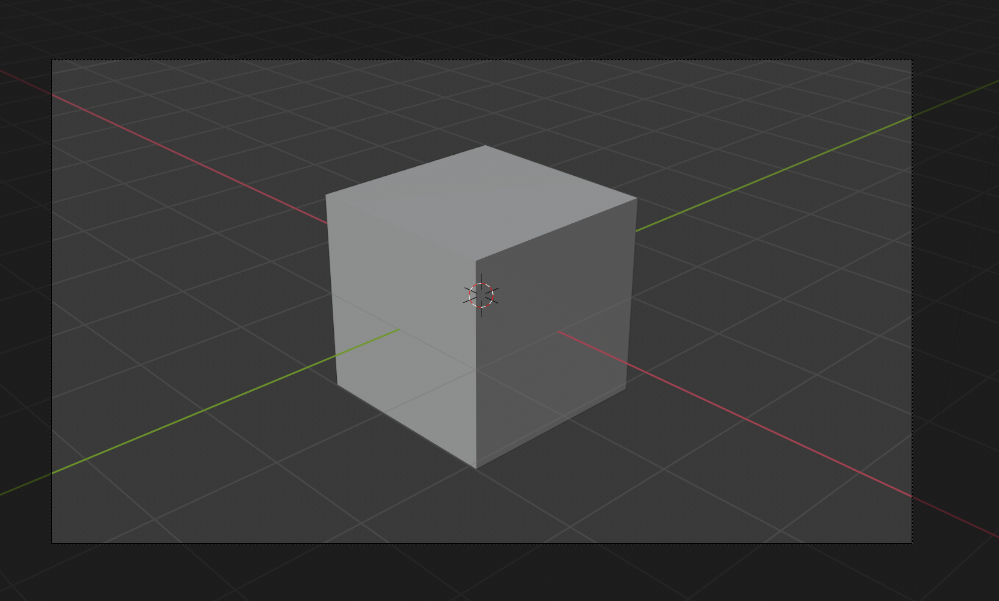

## المشهد الثلاثي الأبعاد

في العرض الثلاثي الأبعاد لديك مشهد ثلاثي الأبعاد، الذي يبدو مثل ما قد تراه في لعبة كمبيوتر على سبيل المثال.

هناك ثلاثة عناصر رئيسية في المشهد ثلاثي الأبعاد نحتاج إلى فهمها للبدء.

### مكعب في المركز

هذا هو ما سيتم تقديمه وإظهاره في الصورة.

### مصدر ضوء

من خلال تدوير المشهد يمكنك رؤية الموضع الدقيق لمصدر الضوء.

+ تدوير المشهد حتى ترى الجزء العلوي من مصدر الضوء.

### الكاميرا

هذا هو المكان الذي سترى فيه المشهد الخاص بك.

+ قم بتدوير مشهدك بحيث يكون خلف الكاميرا. طريقة سهلة للقيام بذلك هي الضغط على `0` في لوحة الارقام، أو الذهاب إلى ` مشاهدة ` `الكاميرا` ثم `الكاميرات` ثم الكاميرات النشطة.

سترى صورة جميلة لجانب المكعب.