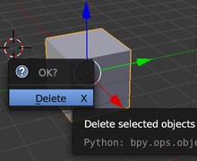

## أضف قرد

لن نكون بحاجة إلى المكعب، لذا دعونا نزيله.

+ حدد المكعب باستخدام زر الماوس الأيسر. يجب أن يظهر حد برتقالي حول المكعب.
+ تأكد من أن الماوس الخاص بك في العرض الثلاثي الأبعاد.
+ اضغط <kbd>X</kbd> لحذف المكعب.
+ سوف تسأل عما إذا كان لا بأس بحذف الكائن.

+ حدد **حذف** أو اضغط <kbd>Enter</kbd>.

لإضافة كائنات إلى المشهد، يمكنك استخدام القائمة المنسدلة **Add**.

+ في القائمة، انتقل إلى قسم **Mesh** وحدد **Monkey**.

سيظهر قرد في المشهد الخاص بك.

+ ضع القرد أمام الكاميرا تماما كما فعلت مع المكعب، بحيث يمكننا رؤيته بعد تقديمه. يمكنك استخدام المقابض الزرقاء والخضراء والحمراء مرة أخرى لتحريك القرد.

