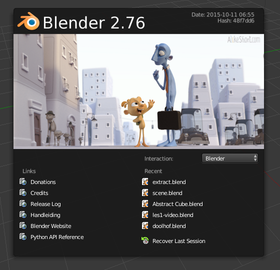

## Zoomen und drehen

+ Starte Blender.

Ein Startbildschirm erscheint sobald du Blender öffnest. Der Startbildschirm von Blender v2.81 sieht folgendermaßen aus:

Für dieses Tutorial brauchen wir den Startbildschirm nicht.

+ Klicke rechts neben dem Startbildschirm um ihn auszublenden.

In der Mitte siehst du die 3D-Ansicht. In diesem Bereich positionierst du alle Elemente, die angezeigt oder gerendert werden müssen. Du hast bereits drei verschiedene Elemente in der 3D-Ansicht. Wir werden uns diese später ansehen.

Mit dem Mausrad kannst du die 3D-Ansicht vergrößern und zu verkleinern.

+ Versuche den Würfel zu vergrößern und zu verkleinern.

Du kannst die gesamte Bühne durch Drücken der mittleren Maustaste oder des Mausrades drehen.

+ Versuche die Bühne zu drehen.

