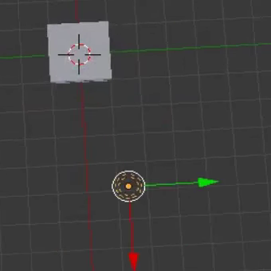

## Die 3D-Szene

In der 3D-Ansicht siehst du eine 3D-Szene, die ein bisschen so aussieht, wie du es beispielsweise von einem Computerspiel gewohnt bist.

Als erstes müssen wir die drei Hauptkomponenten in der 3D-Szene verstehen.

### Ein Würfel in der Mitte

Dieser Gegenstand wird gerendert und im Bild dargestellt.

### Eine Lichtquelle

Durch Drehen der Szene kannst du die genaue Position der Lichtquelle sehen.

+ Dreh die Szene, bis du die Oberseite der Lichtquelle siehst.

### Eine Kamera

Aus dieser Perspective wird Szene aufgenommen.

+ Dreh die Szene so, dass sie sich vor der Kamera befindet. Eine Möglichkeit ist `0` auf dem Nummernblock deiner Tastatur zu drücken oder benutze ` Ansicht ` > ` Kameras ` > ` Aktive Kameras `.

Du wirst ein schönes Bild der Seite des Würfels sehen.