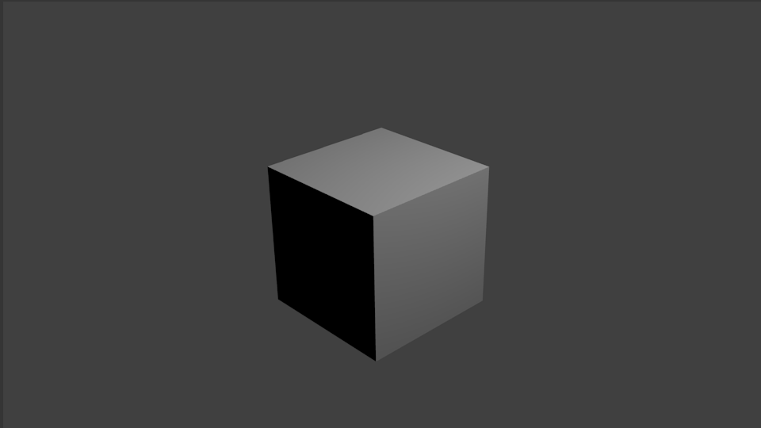

## Rendern

Beim Rendern wird ein Bild aus einem 3D-Modell generiert.

+ Mit <kbd> F12 </kbd> kannst du die Szene rendern. Benutze <kbd> FN + F12 </kbd> wenn du an einem Mac arbeitest.

Du siehst dass die obere und rechte Seite des Würfels beleuchtet ist, die linke Seite jedoch dunkel bleibt. Das liegt daran, dass sich die Lichtquelle oben rechts über dem Würfel befindet.

+ Drücke <kbd> ESC </kbd> um die Renderansicht zu verlassen.