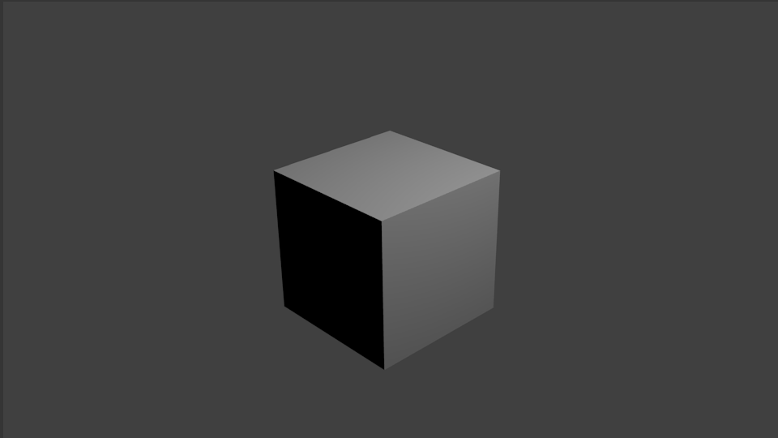

## Auswählen und verschieben

Mit der linken Maustaste kannst du ein Objekt in Blender auswählen.

+ Wähle den Würfel mit der linken Maustaste aus. Du siehst einen orangefarbenen Rand um den Würfel.

Du kannst in Blender Objekte verschieben, indem du den blauen, grünen und roten Pfeil verwendest: der blaue Pfeil verschiebt auf der z-Achse nach oben und unten, der grüne Pfeil verschiebt auf der y-Achse nach links und rechts und der rote Pfeil zieht das Objekt auf der x-Achse näher heran oder schiebt es weiter weg. In Blender 2.8 musst Du in der Liste der Symbole links auf dem Bildschirm auf das Verschieben-Gizmo klicken, damit die Ziehpunkte angezeigt werden.

+ Bewege den Würfel nach oben, indem du den blauen Pfeil mit der linken Maustaste anklickst und die Maus nach oben bewegst. Wenn du den blauen Pfeil anklickst, wird eine blaue Linie angezeigt. Bewege den Würfel entlang der blauen Linie.

+ Schiebe den Würfel nach rechts, indem du den grünen Pfeil mit der linken Maustaste anklickst und nach rechts bewegst. Sobald du den grünen Pfeil anklickst, wird eine grüne Linie angezeigt. Verschieben den Würfel entlang der grünen Linie.

+ Ziehe den Würfel näher heran oder schiebe ihn weg indem du mit der linken Maustaste den roten Pfeil anklickst und die Maus vor- und zurück bewegst. Wenn du den roten Pfeil anklickst, erscheint eine rote Linie. Bewege den Würfel entlang der roten Linie.

+ Verschiebe den Würfel an eine andere Stelle.

+ Gehe in die Renderansicht, um zu sehen, wie das Ergebnis aussehen wird. Zum Beispiel:

Möglicherweise siehst du nichts oder nur einen Teil des Würfels. Das bedeutet, dass sich das Objekt nicht (vollständig) im Blickwinkel der Kamera befindet.

+ Drücke <kbd>ESC</kbd> um die Renderansicht zu verlassen.

+ Bewege die 3D-Szene mit der mittleren Maustaste vor die Kamera. Zum Beispiel:

+ Benutze den blauen, grünen und roten Pfeil um den Würfel so zu verschieben, dass du ihn vor der Kamera sehen kannst.

+ Rendere die Szene erneut um zu sehen, wie das Bild aussieht. Wahrscheinlich wirst du das gleiche Bild wie zuvor sehen.

+ Drücke <kbd>ESC</kbd> um die Renderansicht zu verlassen.