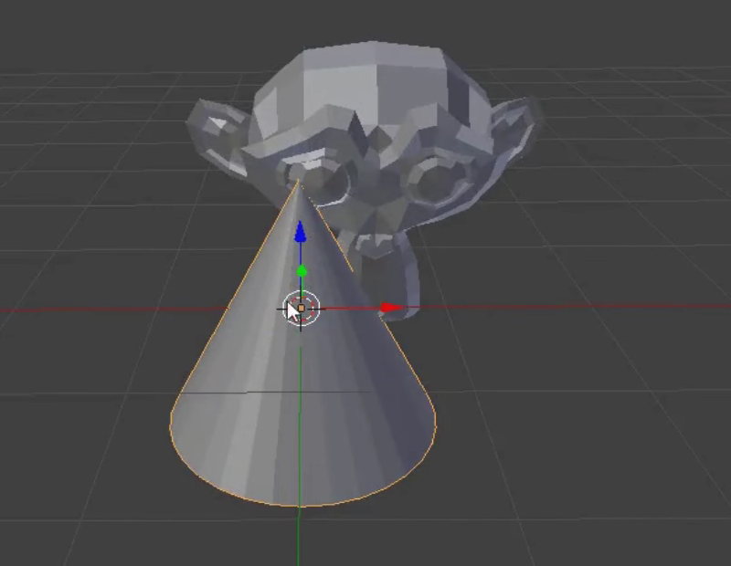

## Füge einen Hut hinzu

Wir können auch einen Hut hinzufügen. Dafür verwenden wir einen Kegel.

+ Wähle **Cone** (Kegel) aus dem **Mesh** (Hinzufügen) Tab.

Ein Kegel sollte in deiner Szene erscheinen. Jetzt hast du einen Affen und einen Kegel.

Nun muss der Kegel auf dem Affen positioniert werden.

+ Dreh und zoom die Ansicht in Richtung Kegel und Affen um eine bessere Sicht auf beide Objekte zu haben.

+ Wähle den Kegel mit der linken Maustaste. Wieder sollte ein orangefarbener Rand darum erscheinen.

+ Verwende den blauen, grünen und roten Pfeil um den Kegel über den Affen zu verschieben. Möglicherweise musst du die Ansicht erneut drehen und zoomen.

+ Prüfe aus verschiedenen Winkeln, ob der Kegel richtig auf dem Affen sitzt.

Jetzt müssen wir sehen, wie das Ergebnis aussieht.

+ Render das Bild.

Das Bild zeigt, dass der Affen nicht gut beleuchtet ist.

+ Drücke <kbd>ESC</kbd> um die Renderansicht zu verlassen.