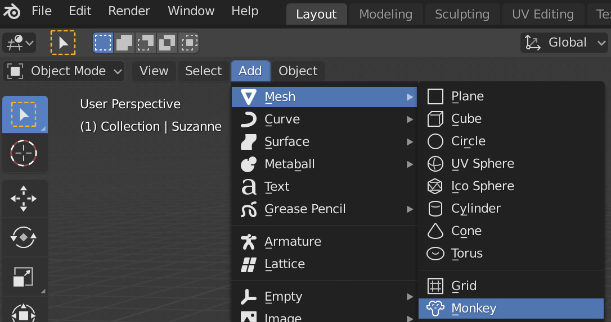

## Πρόσθεσε μια μαϊμού

Δεν θα χρειαστούμε τον κύβο, οπότε ας τον αφαιρέσουμε.

+ Select the cube with the left mouse button. Ένα πορτοκαλί περίγραμμα πρέπει να εμφανιστεί γύρω από τον κύβο.
+ Βεβαιώσου ότι το ποντίκι σου βρίσκεται στην τρισδιάστατη προβολή.
+ Πάτησε <kbd>X</kbd> για να διαγράψεις τον κύβο.
+ Θα ερωτηθείς αν όντως θέλεις να διαγράψεις το αντικείμενο.

+ Επίλεξε **Delete** ή πάτησε <kbd>Enter</kbd>.

To add objects to the scene, you can use the **Add** dropdown menu.

+ In the menu, go to the **Mesh** section and select **Monkey**.

Μια μαϊμού εμφανίζεται στη σκηνή.

+ Τοποθέτησε τη μαϊμού μπροστά από την κάμερα, όπως έκανες με τον κύβο, έτσι ώστε να μπορούμε να το δούμε μετά την αποτύπωση. Μπορείς να χρησιμοποιήσεις ξανά τις μπλε, πράσινες και κόκκινες λαβές για να μετακινήσεις τη μαϊμού.

