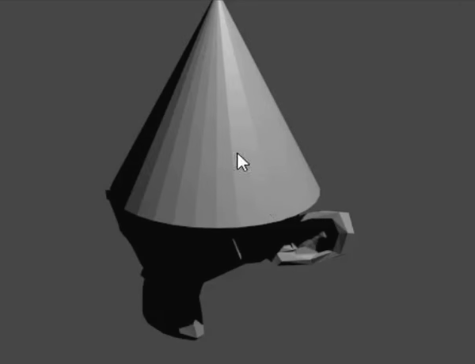

## Πρόσθεσε ένα καπέλο

Μπορούμε επίσης να προσθέσουμε ένα καπέλο. Γι' αυτό θα χρησιμοποιήσουμε έναν κώνο.

+ Select **Cone** from the **Mesh** section.

Ένας κώνος θα πρέπει να εμφανιστεί στη σκηνή. Τώρα έχεις μια μαϊμού και έναν κώνο.

Τώρα ο κώνος πρέπει να τοποθετηθεί πάνω από τη μαϊμού.

+ Γύρισε και μεγέθυνε λίγο τον κώνο και τη μαϊμού για να βλέπεις καλύτερα και τα δύο αντικείμενα.

+ Select the cone using the left mouse button. Πάλι, ένα πορτοκαλί περίγραμμα πρέπει να εμφανιστεί γύρω του.

+ Use the move gizmo and the blue, green, and red handles to move the cone on top of the monkey. Ίσως χρειαστεί να περιστρέψεις και να ζουμάρεις ή ξεζουμάρεις για να έχεις μια σωστή εικόνα.

+ Έλεγξε από διαφορετικές γωνίες εάν ο κώνος είναι σωστά τοποθετημένος στην κορυφή της μαϊμούς.

Τώρα πρέπει να δούμε πώς φαίνεται.

+ Αποτυπωμένη εικόνα.

Η εικόνα δείχνει ότι η μαϊμού δεν είναι πολύ καλά φωτισμένη.

+ Πάτησε <kbd>ESC</kbd> για να βγεις από την προβολή αποτύπωσης.