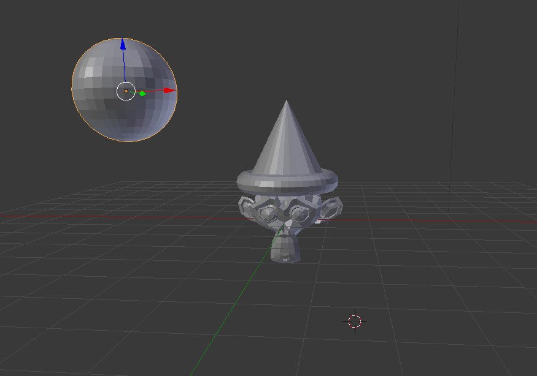

## Πρόκληση: μια νέα σκηνή

+ Πρόσθεσε περισσότερα αντικείμενα από το μενού **Create** στην εργαλειοθήκη.
+ Μετακίνησε τα αντικείμενα γύρω, δημιουργώντας μια διαφορετική σκηνή.
+ Πρόσθεσε μια ντισκομπάλα στη σκηνή του πάρτι.
+ Πρόσθεσε ένα χείλος ή γείσο γύρω από το καπέλο της μαϊμούς.

***

Το έργο αυτό μεταφράστηκε από τους εθελοντές:

Αλέξανδρος Ρονιώτης (Σύλλογος ΨηφίΔα)
Κυριακή Ιντζεΐδου
Μάνος Ζεάκης

Χάρη στους εθελοντές, μπορούμε να δώσουμε σε ανθρώπους σε όλο τον κόσμο την ευκαιρία να μάθουν στη γλώσσα τους. Μπορείτε να μας βοηθήσετε να προσεγγίσουμε περισσότερους ανθρώπους μεταφράζοντας εθελοντικά - περισσότερες πληροφορίες στο [rpf.io/translate](https://rpf.io/translate).