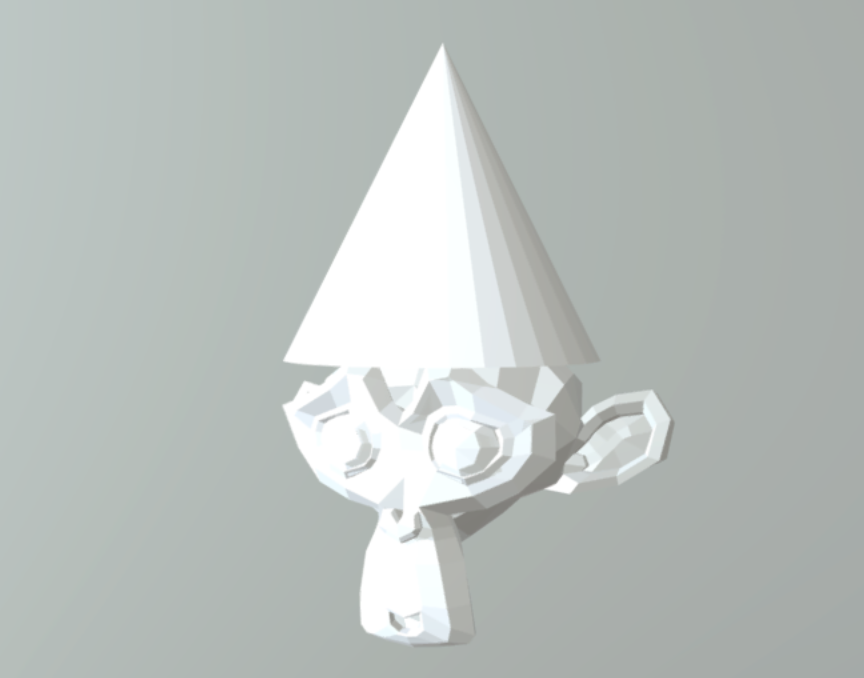

## What you will make

Create a 3D model of a monkey wearing a party hat using Blender.

--- print-only ---

--- /print-only ---

--- no-print ---
Here is how your finished piece will look. Click it and drag it around to see it in 3D!

  <iframe class="responsive-embed__iframe" src="https://sketchfab.com/models/11edaf9b8d1b4d62b5b30b28a292df71/embed" frameborder="0" allowvr allowfullscreen mozallowfullscreen="true" webkitallowfullscreen="true"></iframe>

--- /no-print ---

### You will need:
- [Blender](https://www.blender.org/download/){:target="_blank"} (v2.8 or newer)

