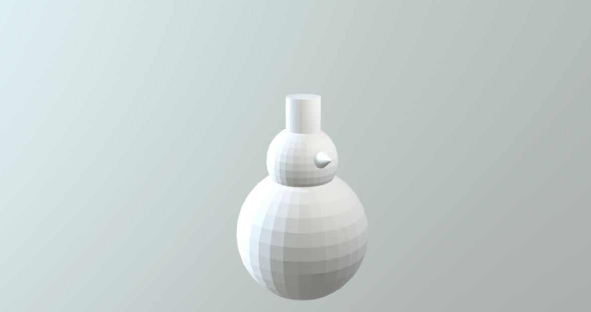

## What can you do now?

If you are following the [Blender](https://projects.raspberrypi.org/en/pathways/blender) pathway, you can move on to the [Snowman](https://projects.raspberrypi.org/en/projects/blender-snowman) project. In this project, you will create a 3D model of a snowman.

--- print-only --- 

--- /print-only ---

--- no-print ---

  <iframe class="responsive-embed__iframe" src="https://sketchfab.com/models/0eb783a971794dae9f7bb4ee63debff0/embed" frameborder="0" allowvr allowfullscreen mozallowfullscreen="true" webkitallowfullscreen="true"></iframe>

--- /no-print ---

Or, why not try out another [Blender](https://projects.raspberrypi.org/en/projects?software%5B%5D=blender) project.