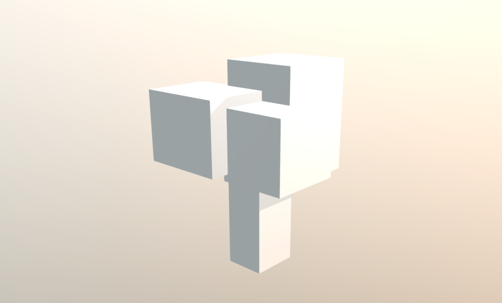

## What can you do now?

If you are following the [Blender](https://projects.raspberrypi.org/en/pathways/blender-basics) pathway, you can move on to the [Snowman](https://projects.raspberrypi.org/en/projects/blender-tree-of-cubes) project. In this project, you will learn how to resize objects by creating a simple tree of cubes.

--- print-only --- 

--- /print-only ---

--- no-print ---

  <iframe class="responsive-embed__iframe" src="https://sketchfab.com/models/0e62596168f84ea0a40b4644c4ecc3f2/embed" frameborder="0" allowvr allowfullscreen mozallowfullscreen="true" webkitallowfullscreen="true"></iframe>

--- /no-print ---

Or, why not try out another [Blender](https://projects.raspberrypi.org/en/projects?software%5B%5D=blender) project.