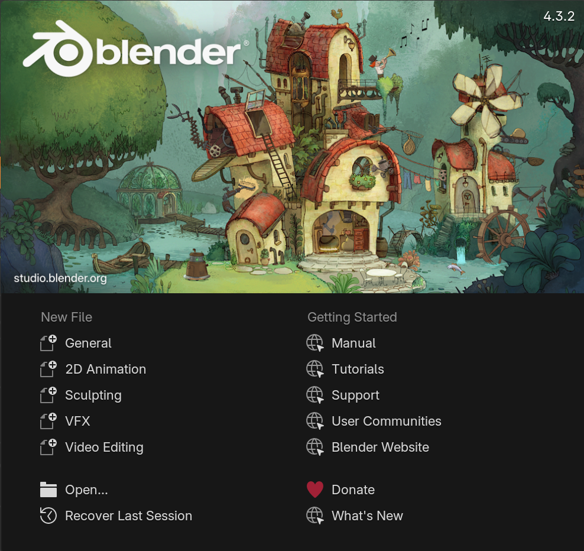
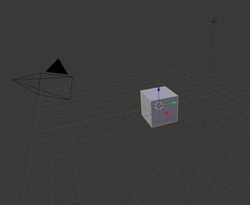
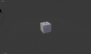
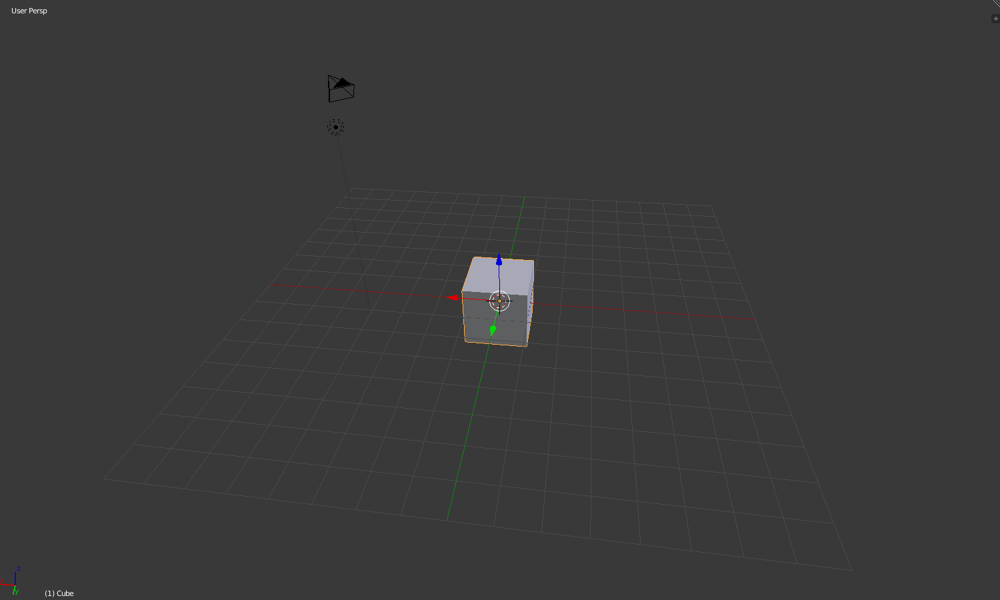

## Zooming and rotating

Open Blender and you will see a screen which looks similar this:

{:style="width:50%;"}

--- task ---
Click somewhere outside of this box to close it.
--- /task --- 

In the centre, you'll see the 3D view which is where you put all the items that need to be displayed or rendered. 

{:style="width:50%;"}

--- task ---
Scroll the mouse wheel forwards and backwards to zoom in and out on the cube. On a laptop, use two fingers on the mousepad to pinch and zoom. 

{:style="width:50%;"}

--- /task ---

--- task ---
Press the middle mouse button/mouse wheel and move the mouse to rotate the scene. On a laptop, use two fingers on the mousepad to rotate the scene.

{:style="width:50%;"}

--- /task ---
