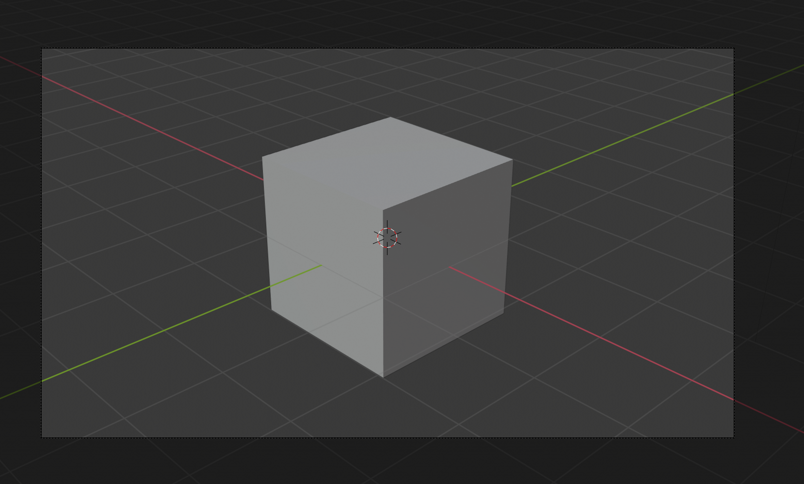

## The 3D scene

In the 3D view you have your 3D scene. The 3D scene might look a bit like you might see in a computer game for example.

There are 3 main components in the 3D scene that we need to understand to get started.

### A cube in the centre

This is what is going to be rendered and shown in the image.

### A light source

By rotating the scene you can see the exact position of the light source.

+ Rotate your scene until you see the top of the light source.

### A camera

This is where you will see your scene through.

+ Rotate your scene behind the camera.

You will see a nice picture of the side of the cube.
