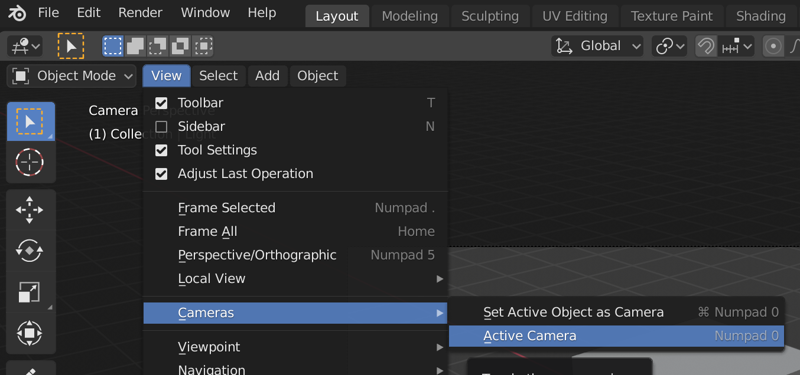

## The 3D scene

In the 3D view you have your 3D scene, which looks a bit like what you might see in a computer game for example.

There are three main components in the 3D scene that we need to understand to get started.

### A cube in the centre

This is what is going to be rendered and shown in the image.

### A light source

By rotating the scene you can see the exact position of the light source.

+ Rotate your scene until you see the top of the light source.

### A camera

This is from where you will see your scene.

+ Rotate your scene so that it is behind the camera. An easy way to do this is to press `0` in you number pad, or go to `View` > `Cameras` > `Active Cameras`.

You will see a nice picture of the side of the cube.

