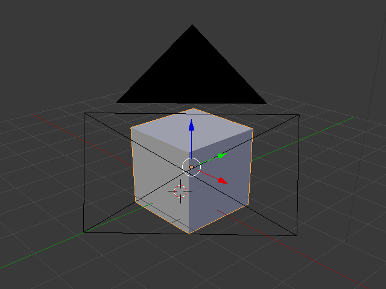

## Selecting and moving

--- task ---
Click the cube with the left mouse button to select it. You'll see an orange border around the cube.
--- /task ---

--- task ---
Click on **Move** in the toolbar.

--- /task ---

Blue, green and red arrows will appear.

--- task ---
Click on the blue arrow with the left mouse button. With the button still held down, move the mouse upwards along the blue line to move the cube.

--- /task ---

+ Move the cube to the right by pressing the green handle with the left mouse button and moving it to the right. When you press the green handle, you'll see a green line appear. Move the cube along the green line.

+ Move the cube in or out by pressing the red handle with the left mouse button and moving it back and forth. When you press the red handle, you'll see a red line appear. Move the cube along the red line.

+ Move the cube around your scene to a different position.

+ Go to the render view to see what it will look like. For example:

You might see nothing or only part of the cube. This means that the object is not (completely) in the camera's view.

+ Press <kbd>ESC</kbd> to get out of the render view.

+ Move the 3D scene with the middle mouse button to behind the camera. For example:

+ Move the cube using the blue, green, and red handles such that you can see the cube from behind the camera.

+ Render again to see how your image looks. You probably will see the same image as before.

+ Press <kbd>ESC</kbd> to exit the render view.
