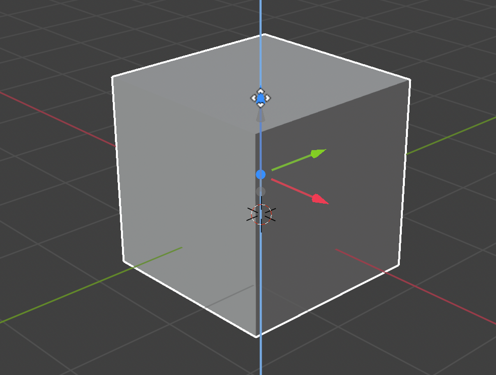

## Selecting and moving

To select an object in Blender you'll have to use the right mouse. In most other software you'd be using the left mouse to select an object, but in Blender it's the right mouse.

+ Select the cube with the right mouse. You'll see an orange border around the cube.

In Blender you can move objects by using the blue, green and red handles. The blue handle, to go up and down on the z-axis, the green handle to go left and right on the y-axis and the red handle to go in and out on the x-axis.

+ Move the cube up by pressing the blue handle with the left mouse and move it up. When you press the blue handle you'll see a blue line appear. Move the cube along the blue line.

+ Move the cube to the right by pressing the green handle with the left mouse and move it to the right. When you press the green handle you'll see a green line appear. Move the cube along the green line.

+ Move the cube in or out by pressing the red handle with the left mouse and move it back and forth. When you press the red handle you'll see a red line appear. Move the cube along the red line.

+ Move the cube around your scene to a different position.

+ Press <kbd>F12</kbd> to see what it would look like. For example:

You might see nothing in the camera or only part of the cube. This means that the object is not (completely) in the camera' s view.

+ Press <kbd>ESC</kbd> to get out of the view.

+ Move the 3D scene with the middle mouse to behind the camera. For example:

+ Move the cube using the blue, green and red handles such that you can see the cube from behind the camera.

+ Press <kbd>F12</kbd> again to render and see how your image looks. You probably will see the same image as before.

+ Press <kbd>ESC</kbd> to exit the render view.
