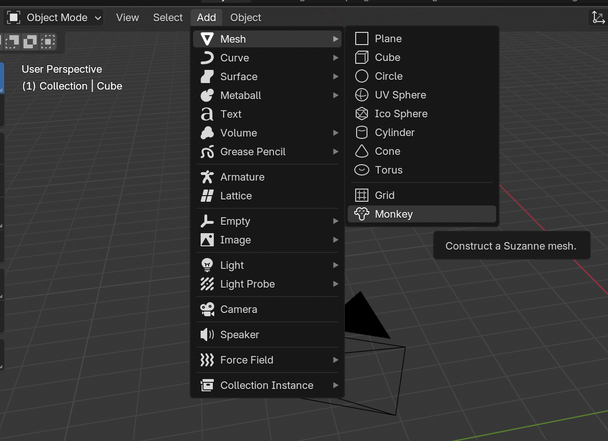
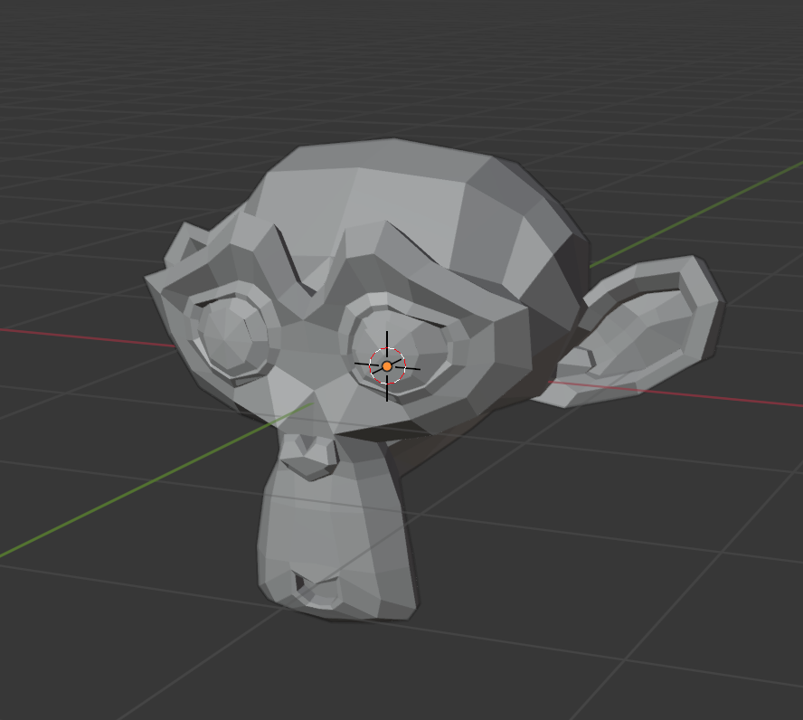

## Add a monkey

We won't be needing the cube, so let's remove it.

+ Select the cube with the right mouse nutton. An orange border should appear around the cube.
+ Make sure your mouse is in the 3D view.
+ Press <kbd>X</kbd> to delete the cube.
+ You'll be asked whether it's OK to delete the object.

+ Select **Delete** or press <kbd>Enter</kbd>.

To add objects to the scene, you can use the toolbox on the left. The toolbox on the left contains a **Create** tab that has a selection of things that you can add.

+ In the toolbox, go to the **Create** tab and select **Monkey**.

A monkey appears in your scene.

+ Position the monkey in front of the camera just like you did with the cube, so that we can see it after rendering. You can use the blue, green, and red handles again to move the monkey.

