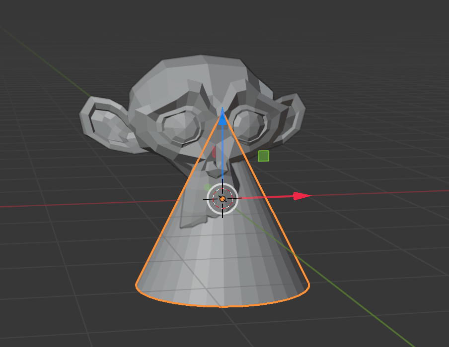

## Add a hat

We can also add a hat. For this we will use a cone.

+ Select **Cone** from the **Create** tab.

A cone should appear in your scene. Now you have a monkey and a cone.

Now the cone needs to be positioned on top of the monkey.

+ Rotate and zoom a bit towards the cone and the monkey to have a better view on both objects.

+ Select the cone using the right mouse button. Again an orange border should appear around it.

+ Use the blue, green, and red handles to move the cone on top of the monkey. You might have to rotate and zoom in or out to get a proper view.

+ Check from different angles if the the cone is positioned properly on top of the monkey.

Now we need to see what it looks like.

+ Render the image.

The image shows that the monkey is not very well lit.

+ Press <kbd>ESC</kbd> to exit the render view.
