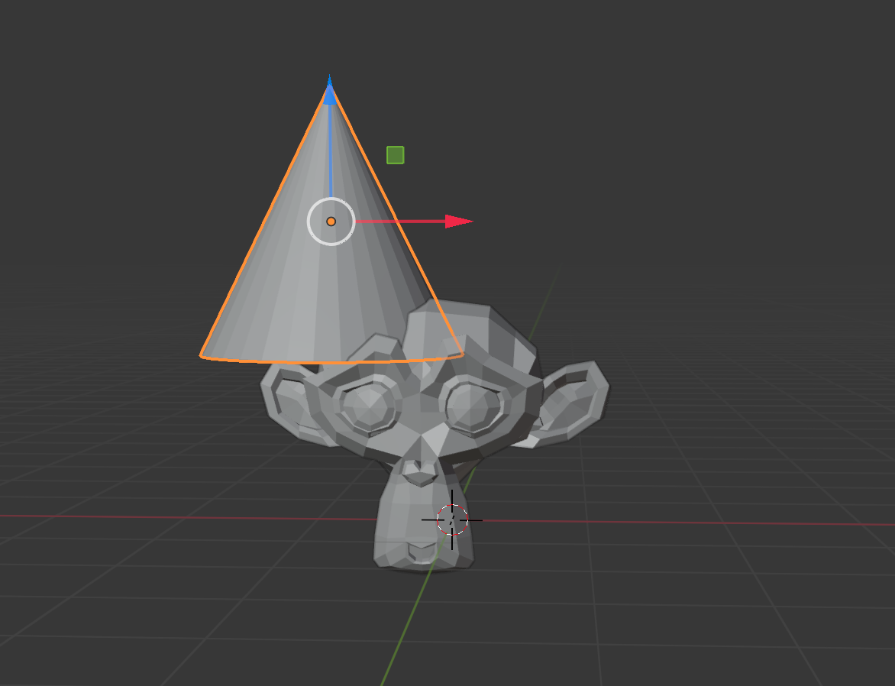

## Add a hat

--- task ---
Click on **Add** > **Mesh** > **Cone**.
--- /task ---

A cone should appear in your scene. 

{:style="width:50%;"}

--- task ---
Select the cone using the left mouse button. 
--- /task ---

--- task ---
Select the **Move** button in the toolbar. Use the blue, green, and red handles to move the cone on top of the monkey's head. 
Check from different angles that the the cone is positioned properly on top of the monkey.

--- /task ---

--- task ---
Render the image. Press <kbd>ESC</kbd> to exit the render view.

--- /task ---
