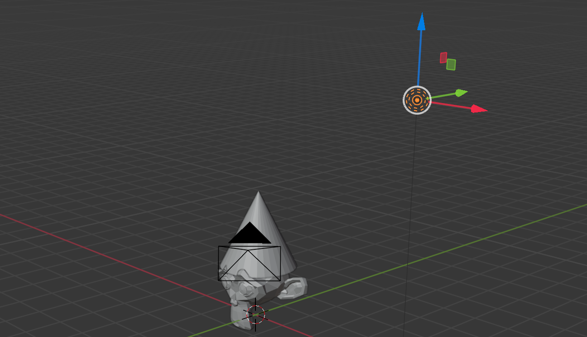

## Change the lighting

Move the light to shine upon the front of the monkey.

--- task ---
Select the **light source** with the left mouse button. Check for the orange border.

--- /task ---

--- task ---
Move the light source using the handles so that it is shining on the front of the monkey's face.
--- /task ---

--- task ---
Render the image again and check whether the light is shining on the monkey's face. 

--- /task ---