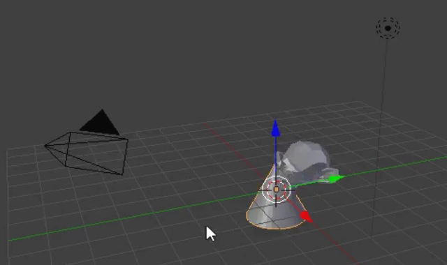
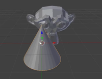
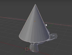
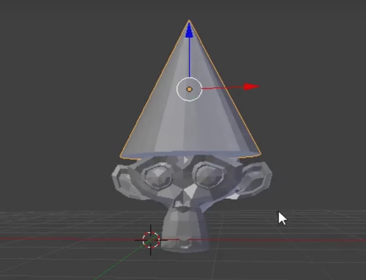
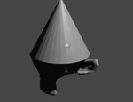

## Add a hat

We can also add a hat. For this we will use a cone.

+ From the toolbox on the left go to the Create tab and select Cone.

A cone appears in your scene. Now you have a monkey and a cone.

Now the cone needs to be positioned on top of the monkey.

+ Rotate and zoom a bit towards the cone and the monkey, to have a better view on both objects.

+ Select the cone using the right mouse. Again an orange border should appear around the cone. See previous image.

+ Use the blue, green and red handles to move the cone on top of the monkey. You might have to rotate and zoom in or out to get a proper view.

+ Check from different angles if the the cone is positioned properly on top of the monkey.

Now we need to see what it looks like.

+ Press <kbd>F12</kbd> to render the image.

The image shows that the monkey is not very well lit.

+ Press <kbd>ESC</kbd> to exit the view
