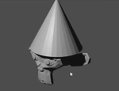

## Change the lighting

We need to move the light to shine upon the front of the monkey.

+ Select the lamp with the left mouse button. Check for the orange border.

+ Move the lamp using the handles so that it is shining on the front of the monkey's face.

+ Render the image again.

+ Check whether the monkey's face is well lit, like in the image below.

+ If it isn't, press <kbd>ESC</kbd> and move the lamp a bit more towards the monkey's face.
