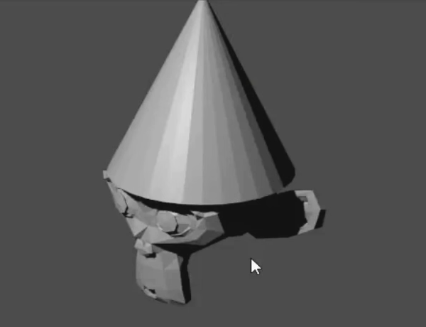

## Change the lighting

We need to move the light to shine upon the front of the monkey.

+ Select the lamp with the right mouse. Check for the orange border.

+ Move the lamp using the blue, green and red handles to the side front of the monkey's face.

+ Press F12 to render the image.

+ Check whether the monkey's face is well lit, like the image below.

+ If not press **ESC** and move the lamp a bit more towards the monkey's face.
