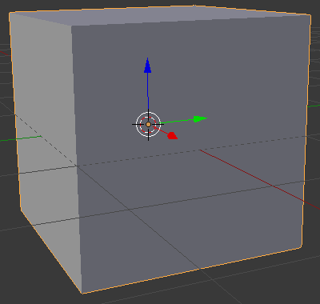
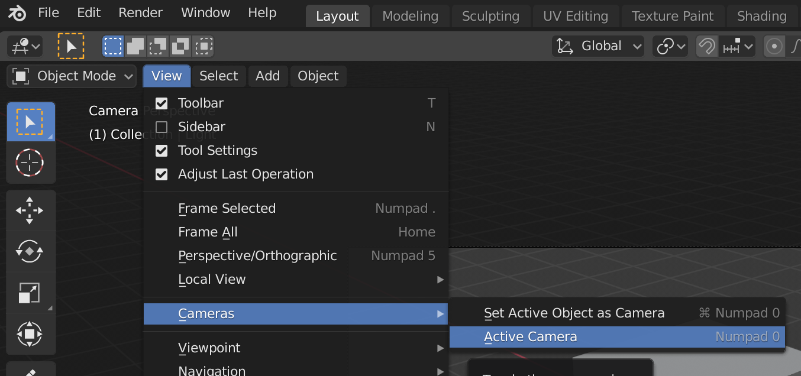

## La escena 3D

En la vista 3D tienes tu escena 3D, que se parece un poco a lo que podrías ver en un videojuego por ejemplo.

Hay 3 componentes principales en la escena 3D que necesitamos entender para empezar.

### Un cubo en el centro

Esto es lo que va a ser renderizado y mostrado en la imagen.

### Una fuente de luz

Girando la escena podrás ver la posición exacta de la fuente de luz.

+ Gira tu escena hasta que puedas ver la parte superior de la fuente de luz.

### Una cámara

Aquí es desde donde verás tu escena.

+ Gira tu escena para que esté detrás de la cámara. Una forma sencilla de hacer esto es pulsar `0` en tu teclado numérico, o ir a `Ver` `Cámaras` > `Cámaras activas`.

Verás una buena foto del lado del cubo.