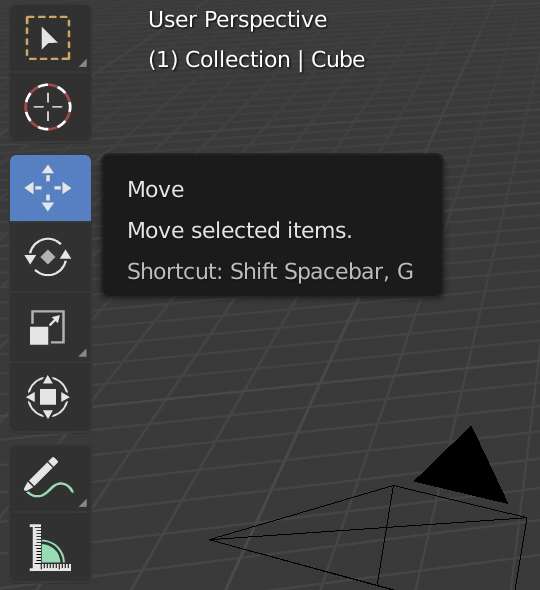
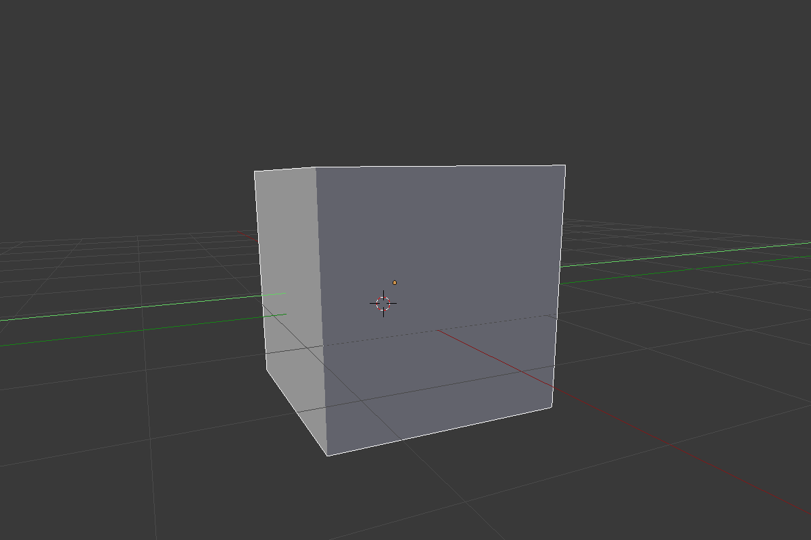

## Selección y movimiento

Para seleccionar un objeto en Blender, tendrás que usar el botón izquierdo del ratón.

+ Selecciona el cubo con el botón izquierdo del ratón. Verás un borde naranja alrededor del cubo.

En Blender puedes mover objetos usando las asas azules, verdes y rojas: El asa azul para subir y bajar en el eje-z, el asa verde para ir a la izquierda y a la derecha en el eje-y y el asa roja para entrar y salir en el eje-x. Desde Blender 2.8, tendrás que hacer clic en el artilugio de movimiento de la lista de iconos a la izquierda de tu pantalla para que aparezcan los controles.

+ Mueve el cubo hacia arriba pulsando el asa azul con el botón izquierdo del ratón y muévelo hacia arriba. Al pulsar el asa azul, verás que aparece una línea azul. Mueve el cubo a lo largo de la línea azul.

+ Mueve el cubo a la derecha pulsando el asa verde con el botón izquierdo del ratón y muévelo a la derecha. Al pulsar el asa verde, verás que aparece una línea verde. Mueve el cubo a lo largo de la línea verde.

+ Mueve el cubo dentro o fuera pulsando el asa roja con el botón izquierdo del ratón y muévelo hacia adelante y hacia atrás. Al pulsar el asa roja, verás que aparece una línea roja. Mueve el cubo a lo largo de la línea roja.

+ Mueve el cubo alrededor de tu escena a una posición diferente.

+ Ve a la vista de renderizado para comprobar como se verá. Por ejemplo:

Es posible que no veas nada o sólo una parte del cubo. Esto significa que el objeto no está (completamente) en la visión de la cámara.

+ Pulsa <kbd>ESC</kbd> para salir de la vista de renderizado.

+ Mueve la escena 3D detrás de la cámara con el botón central del ratón. Por ejemplo:

+ Mueve el cubo usando las asas azules, verdes y rojas de tal forma que puedas ver el cubo detrás de la cámara.

+ Renderiza de nuevo para ver cómo se ve tu imagen. Probablemente verás la misma imagen que antes.

+ Pulsa <kbd>ESC</kbd> para salir de la vista de renderizado.