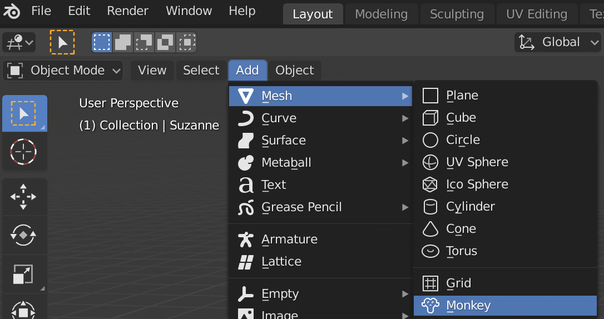
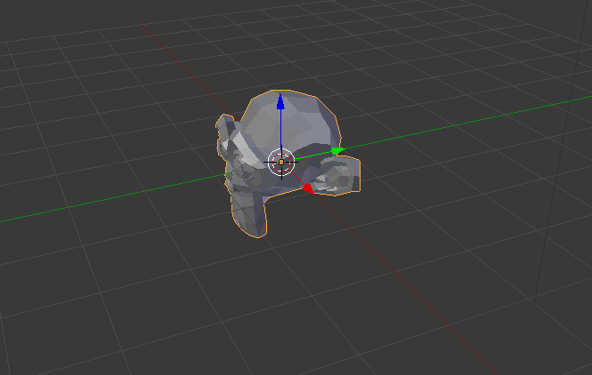

## Añade un mono

No necesitaremos el cubo, así que quitémoslo.

+ Selecciona el cubo con el botón izquierdo del ratón. Un borde naranja debe aparecer alrededor del cubo.
+ Asegúrate de que el ratón está en la vista 3D.
+ Pulsa <kbd>X</kbd> para borrar el cubo.
+ Se te preguntará si estás seguro de que quieres eliminar el objeto.

+ Selecciona **Borrar** o presiona <kbd>Enter</kbd>.

Para añadir objetos a la escena, puedes usar el menú desplegable **Añadir**.

+ En la caja de herramientas, ve a la pestaña **Crear** y selecciona **Mono**.

Un mono aparece en tu escena.

+ Coloca el mono delante de la cámara como lo hicimos con el cubo, para que podamos verlo tras renderizarlo. Puedes usar las asas azules, verdes y rojas de nuevo para mover el mono.

