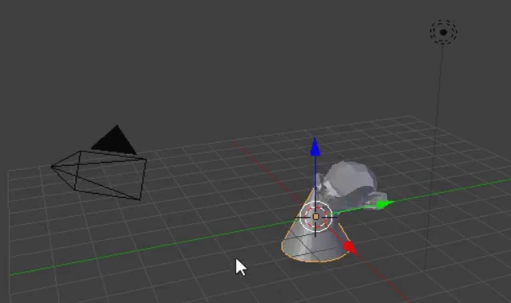

## Añade un sombrero

También podemos añadir un sombrero. Para ello utilizaremos un cono.

+ Selecciona **Cono** en la pestaña **Crear**.

Un cono debe aparecer en tu escena. Ahora tienes un mono y un cono.

Ahora el cono necesita colocarse sobre el mono.

+ Gira y acerca un poco hacia el cono y el mono para tener una mejor visión de ambos objetos.

+ Selecciona el cono usando el botón izquierdo del ratón. De nuevo debería aparecer un borde naranja a su alrededor.

+ Usa las asas azules, verdes y rojas para mover el cono sobre el mono. Es posible que tengas que girar y alejar el zoom para obtener una vista adecuada.

+ Comprueba desde diferentes ángulos si el cono está colocado correctamente en la parte superior del mono.

Ahora tenemos que ver qué aspecto tiene.

+ Renderiza la imagen.

La imagen muestra que el mono no está muy bien iluminado.

+ Pulsa <kbd>ESC</kbd> para salir de la vista de renderizado.