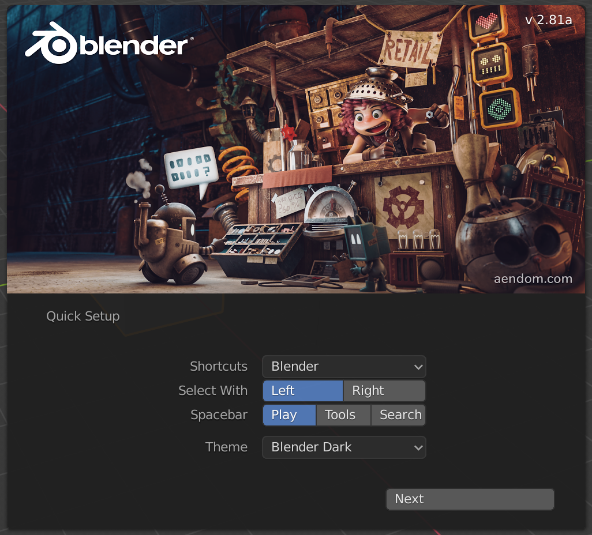
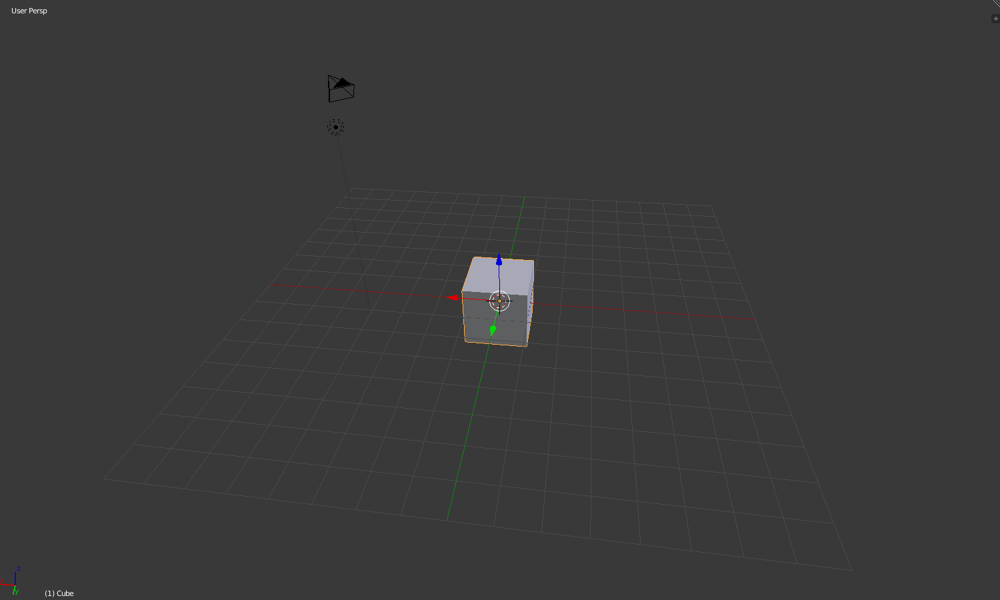

## Acercar y rotar

+ Abre Blender.

Cuando abras Blender, verás una pantalla de inicio. La pantalla de inicio de Blender v2.81 se ve así:

Para este tutorial, no necesitaremos la pantalla de inicio.

+ Haz clic en la parte derecha de la pantalla de inicio para que desaparezca.

En el centro, verás la vista 3D. En este espacio, colocarás todos los elementos que deben mostrarse o representarse. Ya tienes tres elementos diferentes en la vista 3D. Los revisaremos más tarde.

En la vista 3D, puedes acercarte y alejarte con la rueda del mouse.

+ Intenta acercar y alejar el cubo.

Puedes girar toda la escena presionando el botón central del mouse o la rueda del mouse y girando.

+ Intenta girar tu escena.

