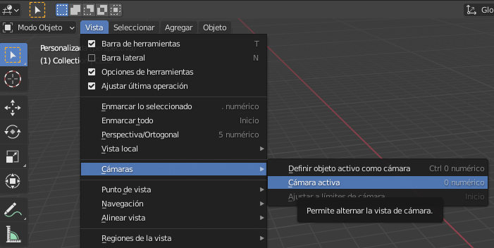

## La escena 3D

En la vista 3D, tienes tu escena 3D, que se parece un poco a lo que puedes ver en un juego de computadora, por ejemplo.

Hay tres elementos principales en la escena 3D que debemos entender para empezar.

### Un cubo en el centro

Esto es lo que se va a representar y mostrar en la imagen.

### Una fuente de luz

Al girar la escena, puedes ver la posición exacta de la fuente de luz.

+ Gira tu escena hasta que veas la parte superior de la fuente de luz.

### Una cámara

Aquí es desde dónde verás tu escena.

+ Gira tu escena para que quede detrás de la cámara. Una forma fácil de hacer esto es presionar `0` en tu teclado, o ir a `Vista` > `Cámaras` > `Cámaras activas`.

Verás una buena imagen del lado del cubo.