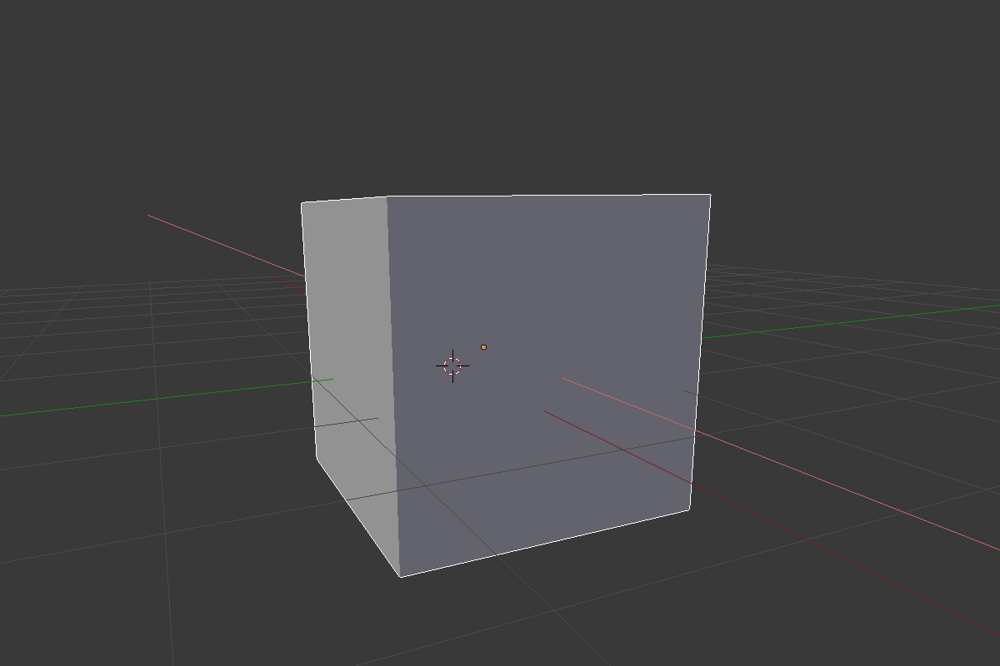

## Seleccionar y mover

To select an object in Blender, use the left mouse button.

+ Select the cube with the left mouse button. Verás un borde anaranjado alrededor del cubo.

En Blender, puedes mover objetos usando los controles azul, verde y rojo: el control azul para subir y bajar en el eje z, la manija verde para ir a la izquierda y la derecha en el eje y, y la manija roja para entrar y salir en el eje x. From Blender 2.8, you will need to click on the move gizmo from the list of icons on the left of your screen to make the handles appear.

+ Mueve el cubo hacia arriba presionando el control azul con el botón izquierdo del mouse y llevándolo hacia arriba. Cuando presiones el control azul, aparecerá una línea azul. Mueve el cubo a lo largo de la línea azul.

+ Mueve el cubo hacia la derecha presionando el control verde con el botón izquierdo del mouse y llevándolo hacia la derecha. Cuando presiones el control verde, aparecerá una línea verde. Mueve el cubo a lo largo de la línea verde.

+ Mueve el cubo hacia adentro o afuera presionando el control rojo con el botón izquierdo del mouse y llevándolo hacia adelante y atrás. Cuando presiones el control rojo, aparecerá una línea roja. Mueve el cubo a lo largo de la línea roja.

+ Mueve el cubo alrededor de tu escena a una posición diferente.

+ Ve a la vista del diseño gráfico para ver cómo se verá. Por ejemplo:

Es posible que no veas nada o solo una parte del cubo. Esto significa que el objeto no está (completamente) en la vista de la cámara.

+ Presiona <kbd>ESC</kbd> para salir de la vista del diseño gráfico.

+ Mueve la escena 3D, con el botón central del mouse, detrás de la cámara. Por ejemplo:

+ Mueve el cubo usando los controles azul, verde y rojo para que puedas ver el cubo desde detrás de la cámara.

+ Ve a la vista del diseño de nuevo para ver cómo se ve la imagen. Probablemente verás la misma imagen que antes.

+ Presiona <kbd>ESC</kbd> para salir de la vista del diseño gráfico.