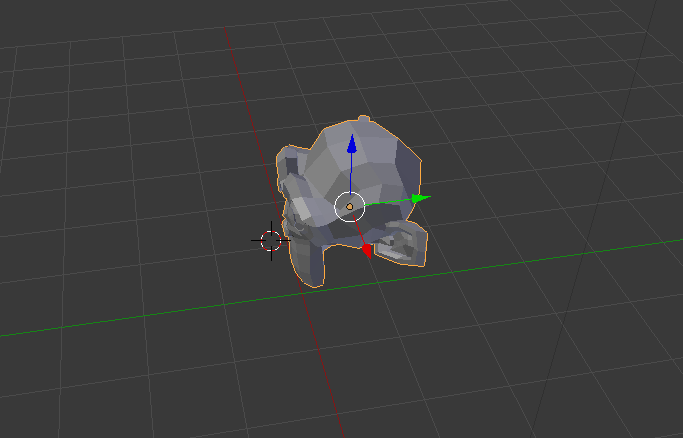

## Agrega una mona

No necesitaremos el cubo, así que vamos a borrarlo.

+ Selecciona el cubo con el botón izquierdo del mouse. Debe aparecer un borde anaranjado alrededor del cubo.
+ Asegúrate de que tu mouse esté en la vista 3D.
+ Presiona <kbd>X</kbd> para borrar el cubo.
+ Te preguntará si deseas borrar el objeto.

+ Selecciona **Borrar** o presiona <kbd>Enter</kbd>.

Para agregar un objeto a la escena, puedes usar **Add** del menú desplegable.

+ En el nenú, dirígete a la sección **Mesh** y selecciona **Monkey**.

Una mona aparecerá en tu escena.

+ Coloca el mono frente a la cámara como lo hiciste con el cubo, para que podamos verlo después de crear tu modelo. Puedes usar los controles azul, verde y rojo de nuevo para mover la mona.

