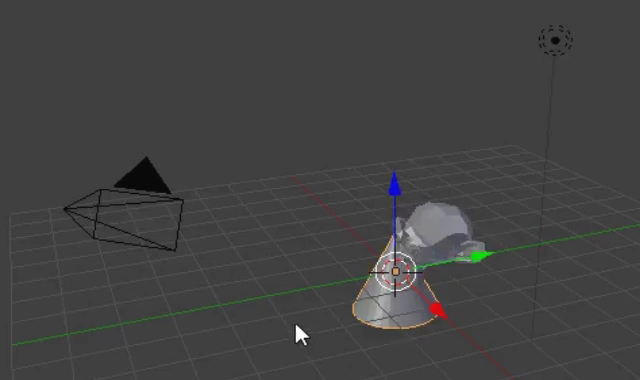
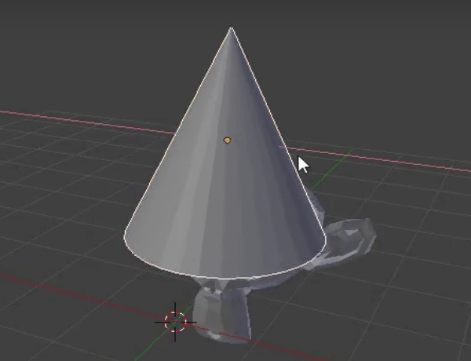

## Agrega un sombrero

También podemos agregar un sombrero. Para esto usaremos un cono.

+ Select **Cone** from the **Mesh** section.

Un cono aparecerá en tu escena. Ahora tienes un mono y un cono.

Ahora el cono debe colocarse sobre la cabeza del mono.

+ Gire y amplíe un poco el cono y el mono para tener una mejor vista de ambos objetos.

+ Select the cone using the left mouse button. Debe aparecer un borde naranja alrededor del cubo.

+ Use the move gizmo and the blue, green, and red handles to move the cone on top of the monkey. Es posible que tengas que girar y acercar o alejar la imagen para tener una vista adecuada.

+ Comprueba, desde diferentes ángulos, si el cono está colocado correctamente sobre la cabeza del cono.

Ahora necesitamos ver cómo se ve.

+ Ve a la escena del diseño gráfico.

La imagen muestra que el mono no está muy bien iluminado.

+ Presiona <kbd>ESC</kbd> para salir de la vista.