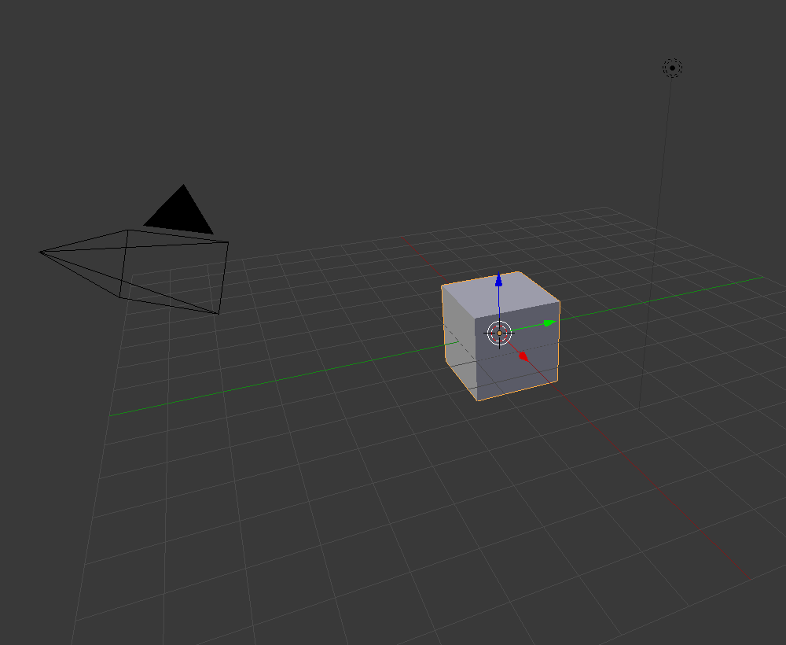

## Zoom et rotation

+ Ouvre Blender.

Lorsque tu ouvres Blender, il démarre par un écran d'accueil. The splash screen of Blender v2.81 looks like this:

Pour ce tutoriel, nous n'aurons pas besoin de l'écran d'accueil.

+ Clique à droite de l'écran d'accueil pour qu'il disparaisse.

Au centre, tu verras la vue 3D. Dans cet espace, tu placeras tous les éléments qui doivent être affichés ou rendus. Tu as déjà trois éléments différents dans la vue 3D. Nous les examinerons plus tard.

Dans la vue 3D, tu peux faire un zoom avant et arrière à l'aide de la molette de la souris.

+ Essaie de faire un zoom avant et arrière sur le cube.

Tu peux faire pivoter toute la scène en appuyant sur le bouton du milieu de la souris ou la molette de la souris et en tournant autour.

+ Essaie de faire pivoter ta scène.

