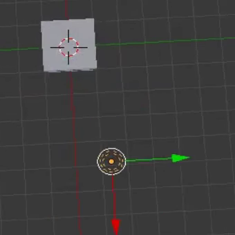

## La scène 3D

Dans la vue 3D, tu as ta scène 3D, qui ressemble un peu à ce que tu pourrais voir dans un jeu sur ordinateur par exemple.

Il y a trois composants principaux dans la scène 3D que nous devons comprendre pour commencer.

### Un cube au centre

C'est ce qui va être rendu et affiché dans l'image.

### Une source de lumière

En faisant pivoter la scène, tu peux voir la position exacte de la source lumineuse.

+ Fais pivoter ta scène jusqu'à ce que tu voies le haut de la source lumineuse.

### Une caméra

C'est de là que tu verras ta scène.

+ Fais pivoter ta scène pour qu'elle soit derrière la caméra. Une façon facile de le faire est d'appuyer sur `0` sur ton pavé numérique, ou d'aller sur `View` > `Cameras` >`Active Camera`.

Tu verras une belle image du côté du cube.