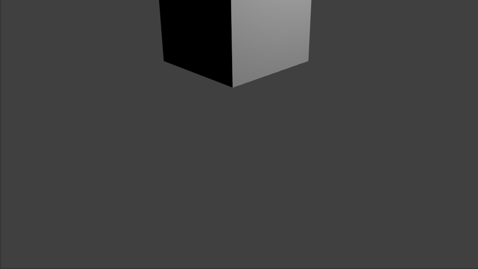

## Sélection et déplacement

To select an object in Blender, use the left mouse button.

+ Select the cube with the left mouse button. Tu verras un contour orange autour du cube.

Dans Blender, tu peux déplacer des objets en utilisant les poignées bleues, vertes et rouges : la poignée bleue pour monter et descendre sur l'axe-z, la poignée verte pour aller à gauche et à droite sur l'axe-y, et la poignée rouge pour entrer et sortir sur l'axe-x. From Blender 2.8, you will need to click on the move gizmo from the list of icons on the left of your screen to make the handles appear.

+ Déplace le cube vers le haut en appuyant sur la poignée bleue avec le bouton gauche de la souris et en le déplaçant vers le haut. Lorsque tu appuies sur la poignée bleue, une ligne bleue apparaît. Déplace le cube sur la ligne bleue.

+ Déplace le cube vers la droite en appuyant sur la poignée verte avec le bouton gauche de la souris et en le déplaçant vers la droite. Lorsque tu appuies sur la poignée verte, une ligne verte apparaît. Déplace le cube le long de la ligne verte.

+ Déplace le cube à l'intérieur ou à l'extérieur en appuyant sur la poignée rouge avec le bouton gauche de la souris et en le déplaçant d'avant en arrière. Lorsque tu appuies sur la poignée rouge, une ligne rouge apparaît. Déplace le cube le long de la ligne rouge.

+ Déplace le cube sur ta scène vers une position différente.

+ Va dans la vue de rendu pour voir à quoi il ressemblera. Par exemple :

Tu pourrais ne rien voir ou seulement une partie du cube. Cela signifie que l'objet n'est pas (complètement) dans la vue de la caméra.

+ Appuie sur <kbd>ECHAP</kbd> pour sortir de la vue de rendu.

+ Déplace la scène 3D avec le bouton central de la souris vers l'arrière de la caméra. Par exemple :

+ Déplace le cube en utilisant les poignées bleues, vertes et rouges de sorte que tu puisses voir le cube de derrière la caméra.

+ Fais de nouveau un rendu pour voir à quoi ressemble ton image. Tu verras probablement la même image qu'avant.

+ Appuie sur <kbd>ECHAP</kbd> pour quitter la vue de rendu.