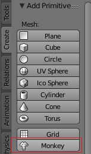

## Ajouter un singe

Nous n'aurons pas besoin du cube, alors retirons-le.

+ Select the cube with the left mouse button. Un contour orange devrait apparaître autour du cube.
+ Assure-toi que ta souris est dans la vue 3D.
+ Appuie sur <kbd>X</kbd> pour supprimer le cube.
+ On te demandera si tu es d'accord de supprimer l'objet.

+ Sélectionne **Delete** ou appuie sur <kbd>Entrée</kbd>.

To add objects to the scene, you can use the **Add** dropdown menu.

+ In the menu, go to the **Mesh** section and select **Monkey**.

Un singe apparaît dans ta scène.

+ Positionne le singe devant la caméra comme tu l'as fait avec le cube, de sorte que nous puissions le voir après le rendu. Tu peux utiliser à nouveau les poignées bleues, vertes et rouges pour déplacer le singe.

