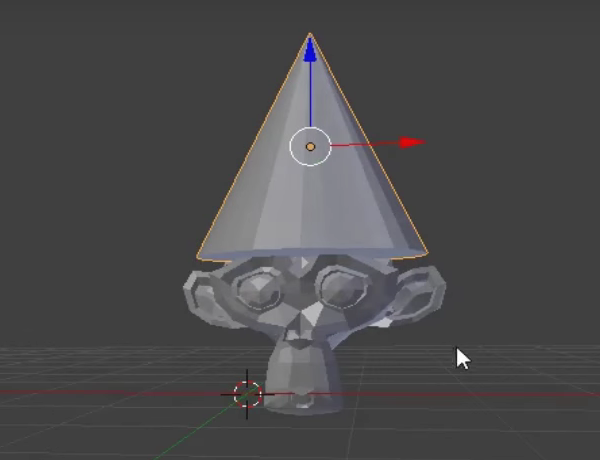

## Ajouter un chapeau

Nous pouvons également ajouter un chapeau. Pour cela, nous utiliserons un cône.

+ Sélectionne **Cone** dans la section **Mesh**.

Un cône devrait apparaître dans ta scène. Maintenant tu as un singe et un cône.

Maintenant le cône doit être positionné au-dessus du singe.

+ Fais pivoter et zoome un peu vers le cône et le singe pour avoir une meilleure vue sur les deux objets.

+ Sélectionne le cône à l'aide du bouton gauche de la souris. Une fois de plus, un contour orange devrait apparaître autour de lui.

+ Utilise le gizmo de déplacement et les poignées bleues, vertes et rouges pour déplacer le cône au-dessus du singe. Tu devras peut-être faire pivoter et faire un zoom avant ou arrière pour avoir une bonne vue.

+ Vérifie sous différents angles si le cône est correctement positionné au-dessus du singe.

Maintenant, nous devons voir à quoi cela ressemble.

+ Fais un rendu de l'image.

L'image montre que le singe n'est pas très bien éclairé.

+ Appuie sur <kbd>ECHAP</kbd> pour quitter la vue de rendu.