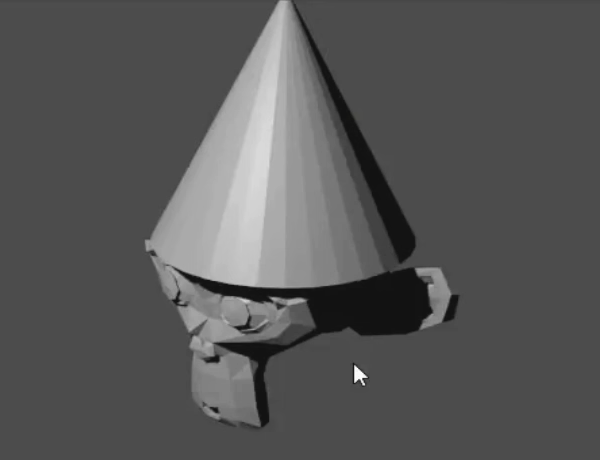

## Change the lighting

Nous devons déplacer la lumière pour qu'elle brille sur l'avant du singe.

+ Select the lamp with the left mouse button. Vérifie le contour orange.

+ Déplace la lampe à l'aide des poignées pour qu'elle s'illumine sur l'avant du visage du singe.

+ Fais de nouveau un rendu de l'image.

+ Vérifie si le visage du singe est bien éclairé, comme dans l'image ci-dessous.

+ Si ce n'est pas le cas, appuie sur <kbd>ECHAP</kbd> et déplace la lampe un peu plus vers le visage du singe.