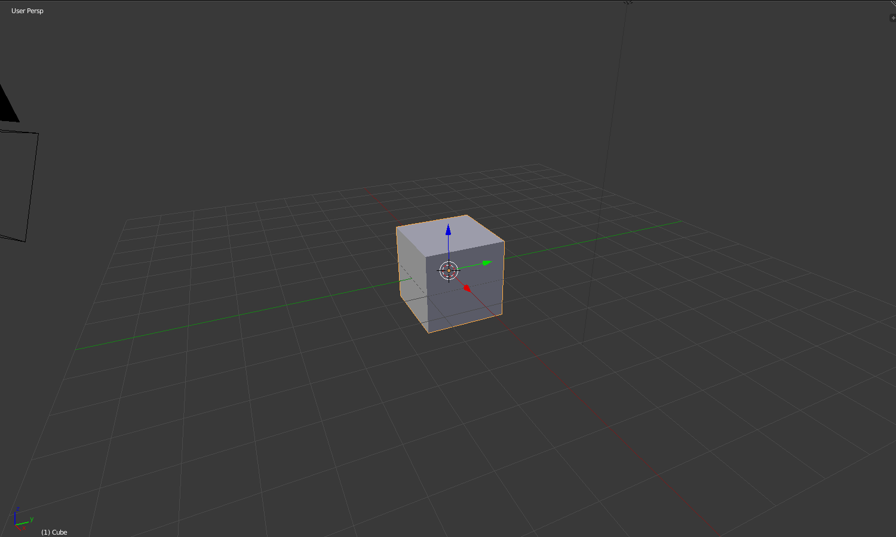

## ज़ूम करना और रोटेट करना

+ Blender खोलें।

जब आप Blender खोलेंगे, तो यह स्प्लैश स्क्रीन से आरंभ होगा। Blender v2.81 की स्प्लैश स्क्रीन इस तरह दिखती है:

इस Tutorial के लिए हमें स्प्लैश स्क्रीन की आवश्यकता नहीं होगी।

+ इसे गायब करने के लिए स्प्लैश स्क्रीन के दाईं ओर क्लिक करें।

मध्य में, आप 3D व्यू देखेंगे। इस जगह में आप उन सभी वस्तुओं को स्थापित करेंगे जिन्हें प्रदर्शित या प्रस्तुत करने की आवश्यकता है। 3D व्यू में आपके पास पहले से ही तीन अलग-अलग वस्तुएँ हैं। हम उन्हें बाद में देखेंगे।

3D व्यू में, आप माउस व्हील का उपयोग करके ज़ूम इन और आउट कर सकते हैं।

+ क्यूब से ज़ूम इन और आउट करने का प्रयास करें।

आप माउस के बीच वाले बटन या माउस व्हील को दबाकर और इधर-उधर घुमाकर पूरे दृश्य को घुमा सकते हैं।

+ अपने दृश्य को घुमाने का प्रयास करें।

