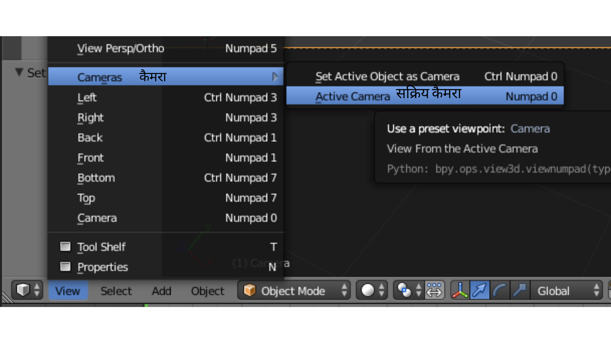

## 3D दृश्य

3D व्यू में आपको अपना 3D दृश्य मिलता है, जो उदाहरण के लिए ऐसा दिखता है जैसा आप किसी कंप्यूटर गेम में देखते हैं।

3D दृश्य में तीन मुख्य घटक हैं जिन्हें हमें शुरू करने के लिए समझने की आवश्यकता है।

### मध्य में एक क्यूब

इसे ही छवि में प्रस्तुत किया जाएगा और दिखाया जाएगा।

### प्रकाश का स्रोत

दृश्य को घुमाकर आप प्रकाश के स्रोत की सही स्थिति देख सकते हैं।

+ जब तक आप प्रकाश स्रोत के शीर्ष को नहीं देखते हैं तब तक अपने दृश्य को घुमाएँ।

### कैमरा

यह वह जगह है जहाँ से आप अपना दृश्य देखेंगे।

+ अपने दृश्य को घुमाएँ ताकि यह कैमरे के पीछे हो। ऐसा करने का एक आसान तरीका यह है कि अपने नंबर पैड में `0` दबाएँ, या `View` > `Cameras` > `Active Cameras` में जाएँ।

आप क्यूब के किनारे का एक बढ़िया चित्र देखेंगे।