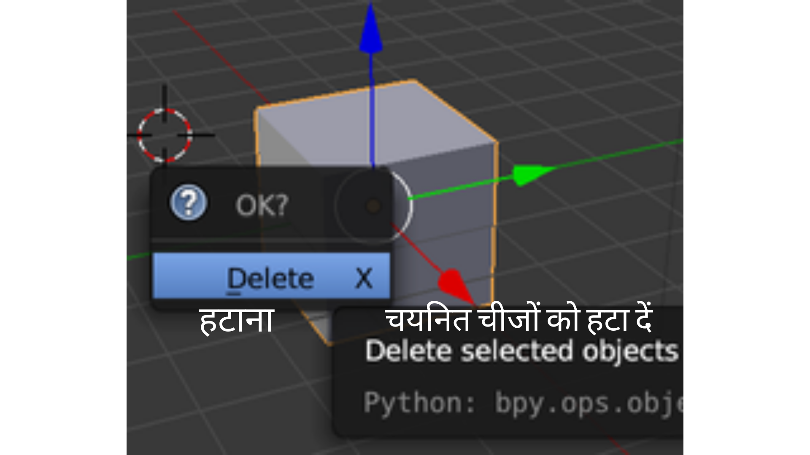
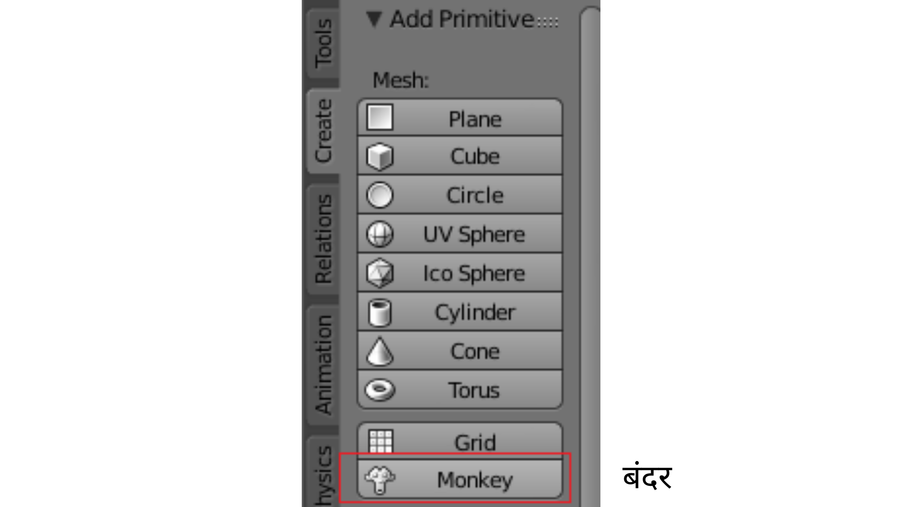
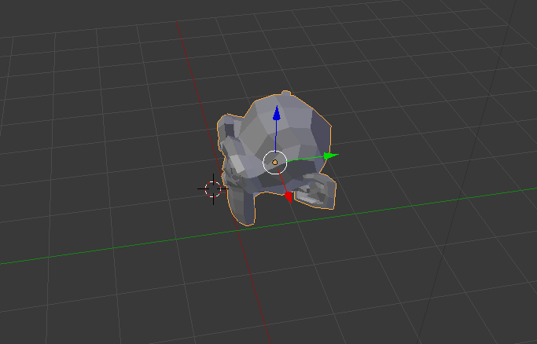

## एक बंदर जोड़ें

हमें क्यूब की आवश्यकता नहीं होगी, तो चलिए इसे हटा दें।

+ Select the cube with the left mouse button. क्यूब के चारों ओर एक नारंगी बॉर्डर दिखाई देना चाहिए।
+ सुनिश्चित करें कि आपका माउस 3D व्यू में है।
+ क्यूब को हटाने के लिए <kbd>X</kbd> दबाएँ।
+ आपसे पूछा जाएगा कि क्या वस्तु को हटाना ठीक है।

+ **Delete** का चयन करें या <kbd>Enter</kbd> दबाएँ।

To add objects to the scene, you can use the **Add** dropdown menu.

+ In the menu, go to the **Mesh** section and select **Monkey**.

आपके दृश्य में एक बंदर दिखाई देता है।

+ बंदर को कैमरे के सामने उसी तरह लाएँ जिस तरह आप क्यूब को लाए थे, ताकि हम इसे प्रस्तुत करने के बाद देख सकें। आप बंदर को दूसरी जगह पर ले जाने के लिए फिर से नीले, हरे, और लाल हैंडल का उपयोग कर सकते हैं।

