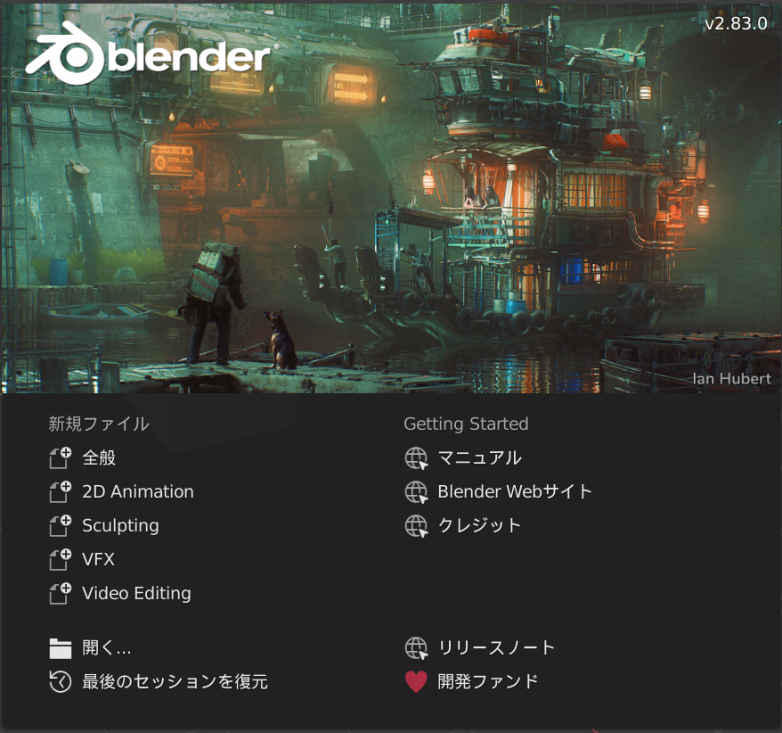

## ズームと回転

+ Blenderを開きます

Blenderを開くと、スプラッシュ画面から始まります。 Blender v2.83.0のスプラッシュ画面はこんな感じです：

このチュートリアルでは、スプラッシュ画面は必要ありません。

+ スプラッシュ画面の右側をクリックして消します。

中央には3Dビューが表示されます。 この空間に表示またはレンダリングする必要があるすべてのアイテムを置きます。 3Dビューにはすでに3種類のアイテムがあります。 これらについては後ほど説明します。

3Dビューでは、マウスホイールを使ってズームイン（拡大（かくだい））とズームアウト（縮小（しゅくしょう））ができます。

+ キューブ（立方体）をズームイン・ズームアウトしてみましょう。

マウスの真ん中のボタンもしくはマウスホイールを押して回すとシーン全体を回転できます。

+ シーンを回転させてみてください。

