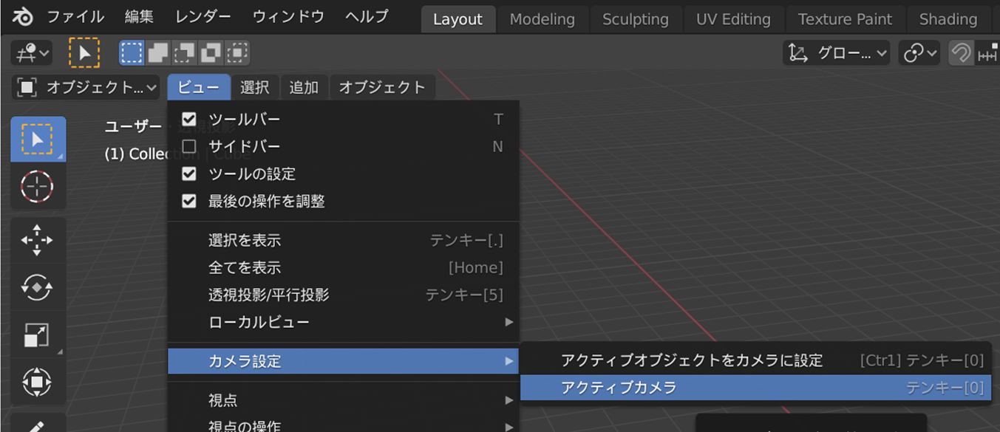
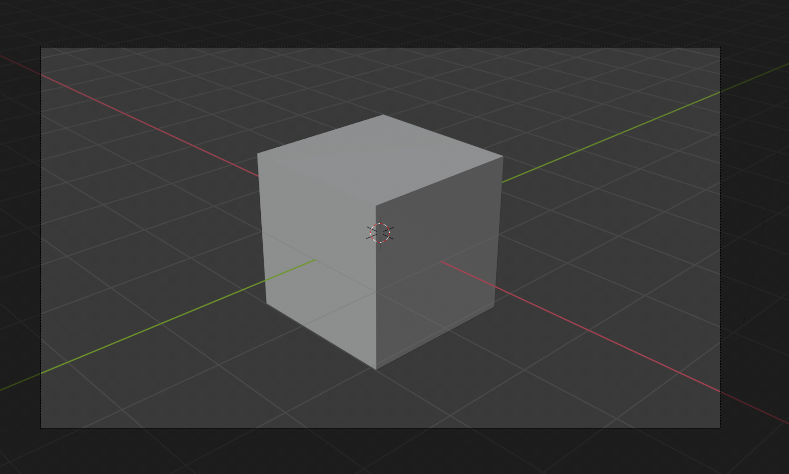

## 3Dシーン

3Dビューには3Dシーンがあります。3Dシーンは、たとえばコンピュータゲームの中で見るものとちょっと似ています。

3Dシーンには、始めるにあたってわかっておく必要があるものが3つあります。

### 中央のキューブ（立方体）

これがレンダリングされ、画像に表示されます。

### 光源（こうげん）

シーンを回転させることで、光源（こうげん）の正確な位置がわかります。

+ 光源（こうげん）の上部が見えるまでシーンを回転させます。

### カメラ

ここから自分が見ているシーンが見えます。

+ カメラの後ろになるようにシーンを回転させます。 これをかんたんに行うには、テンキーで`0`を押すか、`ビュー` > `カメラ設定` > `アクティブカメラ`と進みます。

キューブ（立方体）の面がうまく表示されます。