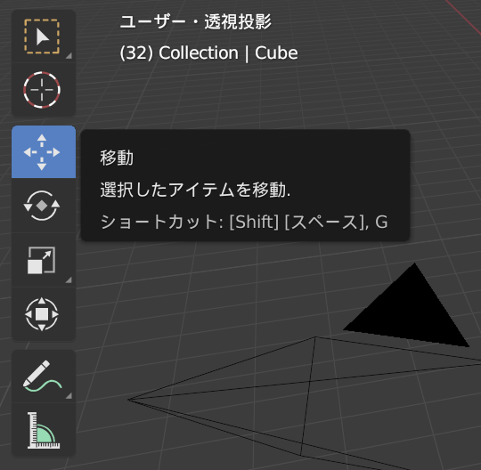
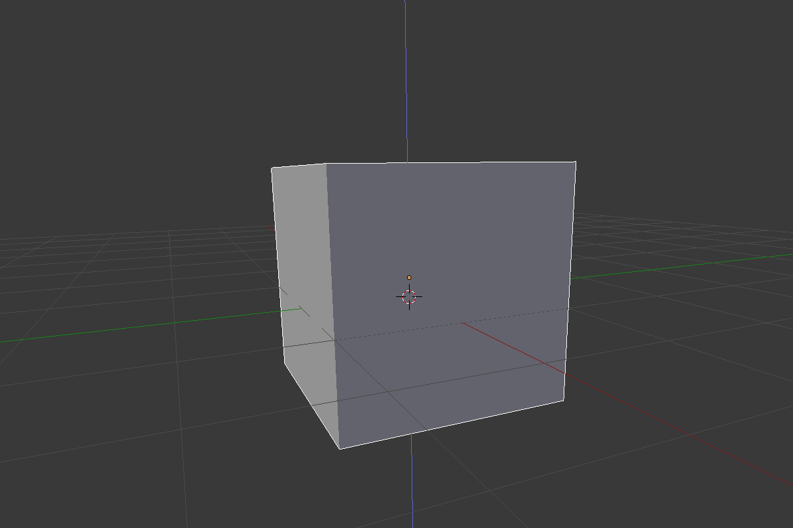

## 選択と移動

Blenderでオブジェクトを選択するには、マウスの左ボタンを使います。

+ マウスの左ボタンでキューブ（立方体）を選択します。 キューブ（立方体）の輪郭（りんかく）が橙（だいだい）色で表示されます。

Blenderでは、青色・緑色・赤色のハンドルを使ってオブジェクトを動かせます。青色のハンドルでz軸上で上下に移動し、緑色のハンドルでy軸上で左右に移動し、赤色のハンドルでx軸上で前後に移動します。 Blender 2.8以降では、ハンドルを表示するために画面左にあるアイコン一覧で移動ギズモをクリックする必要があります。

+ マウスの左ボタンで青色のハンドルを押したまま上に動かすと、キューブ（立方体）が上に移動します。 青色のハンドルを押すと、青色の線が表示されます。 青色の線にそってキューブ（立方体）を動かします。

+ マウスの左ボタンで緑色のハンドルを押したまま右に動かすと、キューブ（立方体）が右に移動します。 緑色のハンドルを押すと、緑色の線が表示されます。 緑色の線にそってキューブ（立方体）を動かします。

+ マウスの左ボタンで赤色のハンドルを押したまま前後に動かすと、キューブ（立方体）が前後に移動します。 赤色のハンドルを押すと、赤色の線が表示されます。 赤色の線にそってキューブ（立方体）を動かします。

+ キューブ（立方体）をシーンの別の場所に移動します。

+ レンダービューに移動して、どのように見えるか確かめます。 例：

何も表示されないか、キューブ（立方体）の一部しか表示されないことがあります。 これは、オブジェクトがカメラから見える範囲に（完全には）入っていないことを意味しています。

+ <kbd>ESC</kbd>（エスケープ）キーを押してレンダービューから抜けます。

+ マウスの真ん中ボタンで3Dシーンをカメラの後ろに移動します。 例：

+ 青色・緑色・赤色のハンドルを使って、カメラの後ろからキューブ（立方体）が見えるようにキューブ（立方体）を動かします。

+ もう一度レンダリングして、画像がどのように表示されるか確かめます。 移動する前と同じ画像が表示されるはずです。

+ <kbd>ESC</kbd>（エスケープ）キーを押してレンダービューから抜けます。