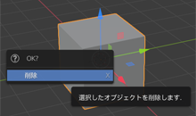
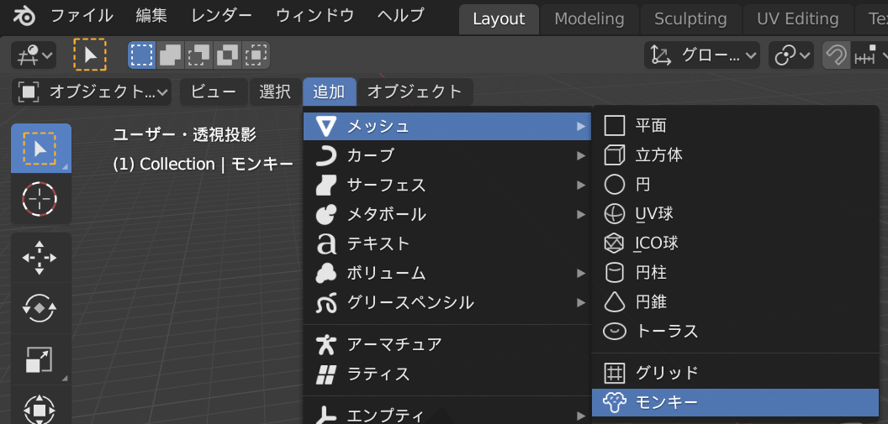

## サルを追加する

もうキューブ（立方体）は必要ないので、消してみましょう。

+ マウスの左ボタンでキューブ（立方体）を選択します。 キューブ（立方体）のまわりに橙（だいだい）色の線が表示されます。
+ マウスが3Dビューにあることを確認します。
+ <kbd>X</kbd>キーを押してキューブ（立方体）を消します。
+ オブジェクトを消してもよいか聞かれます。

+ **削除**を選択するか、<kbd>Enter</kbd>キーを押します。

シーンにオブジェクトを追加するには、ドロップダウンメニューの**追加**を使います。

+ メニューで**メッシュ**に移動し、**モンキー**を選びます。

シーンにサルが表示されます。

+ キューブ（立方体）でやったのと同じように、レンダリングした後にサルが見えるようにサルをカメラの前に置きます。 青色・緑色・赤色のハンドルを使ってサルを動かします。

