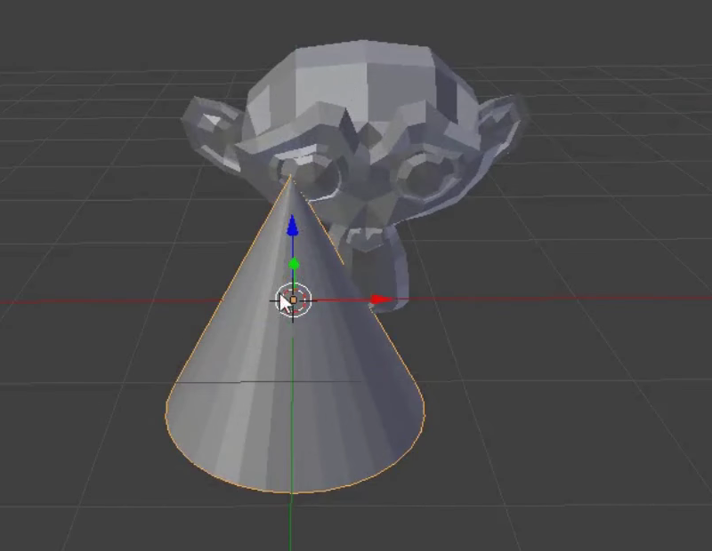

## 帽子（ぼうし）を追加する

帽子（ぼうし）も追加できます。 これには円錐（えんすい）を使います。

+ **メッシュ**から**円錐**（えんすい）を選びます。

円錐（えんすい）がシーンに表示されます。 これでサルと円錐（えんすい）が表示されました。

次に、サルの頭上に円錐（えんすい）を置く必要があります。

+ 円錐（えんすい）とサルの方にちょっと回転してズームすると、どちらも見やすくなります。

+ マウスの左ボタンで円錐（えんすい)を選択します。 円錐（えんすい）のまわりに橙（だいだい）色の線が表示されます。

+ 移動ギズモで青色・緑色・赤色のハンドルを使って、サルの頭上に円錐（えんすい）を移動します。 きちんと見えるようにするためには、回転したり拡大縮小したりする必要があるかもしれません。

+ サルの頭上に円錐（えんすい）が正しく置かれているかどうか、さまざまな角度から確認します。

どのように見えるか確認します。

+ 画像をレンダリングします。

画像を見ると、サルにうまく光があたっていないことがわかります。

+ <kbd>ESC</kbd>（エスケープ）キーを押してレンダービューから抜けます。