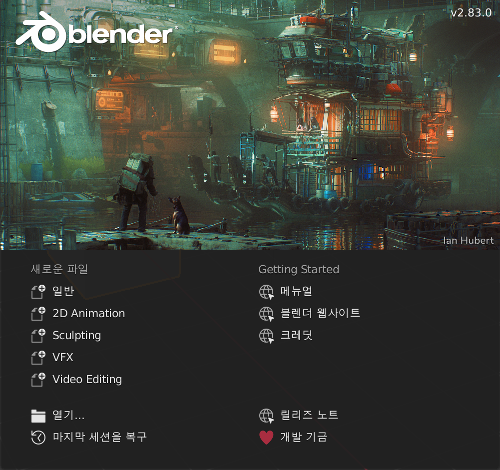

## 확대 및 축소 기능

+ Blender를 엽니다.

Blender를 열면 시작 화면이 표시됩니다. Blender v2.81의 시작 화면은 다음과 같습니다:

이 튜토리얼에서는 시작 화면이 필요하지 않습니다.

+ 시작 화면의 오른쪽을 클릭하면 사라질 것입니다.

중앙에는 3D 보기가 표시됩니다. 이곳에서는 표시하거나 렌더링해야 하는 모든 항목을 배치할 것입니다. 3D 보기에 이미 세 가지 항목이 있을 것입니다. 이것들은 나중에 살펴볼 것입니다.

3D 뷰에서 마우스 휠을 사용하여 확대 및 축소 할 수 있습니다.

+ 큐브를 확대 및 축소 해보세요.

마우스 가운데 버튼 또는 마우스 휠을 누르고 회전하면 전체 장면을 회전할 수 있습니다.

+ 장면을 회전시켜보세요.

