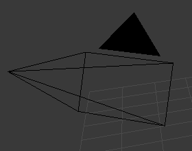
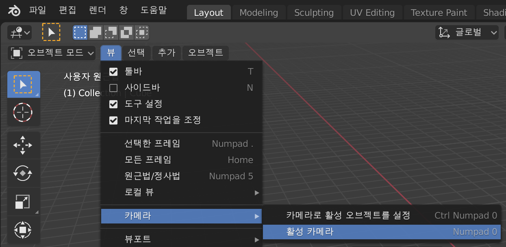

## 3D 장면

3D 보기에는 컴퓨터 게임에서 볼 수 있는 것과 같은 3D 장면이 있습니다.

3D 장면에는 시작하기 위해 이해해야 할 세 가지 주요 구성 요소가 있습니다.

### 중앙에 위치한 큐브

이것이 이미지에서 렌더링되고 보여 질 것입니다.

### 광원

장면을 회전시키면 광원의 정확한 위치를 볼 수 있습니다.

+ 광원의 상단부가 보일 때까지 장면을 회전시킵니다.

### 카메라

장면을 이 지점을 기준으로 보게 될 것입니다.

+ 카메라 뒤에 있도록 장면을 회전시킵니다. 숫자패드에서 `0`을 누르거나, `View` > `Cameras` > `Active Cameras`를 차례로 누릅니다.

큐브 측면을 확인할 수 있을 것입니다.